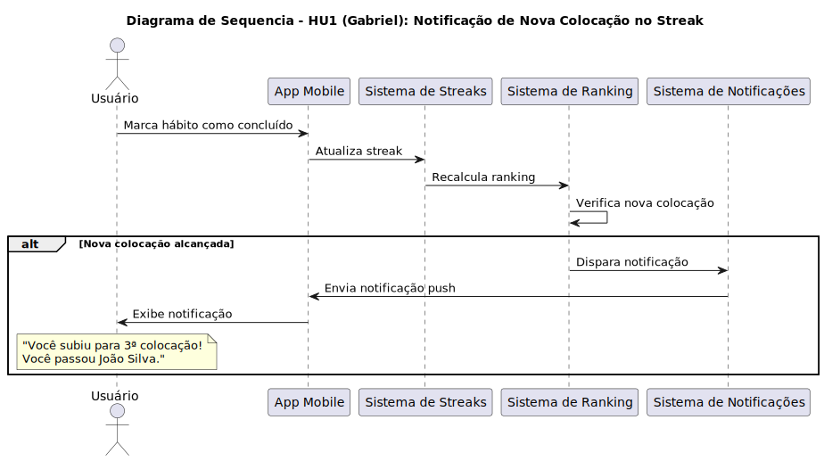
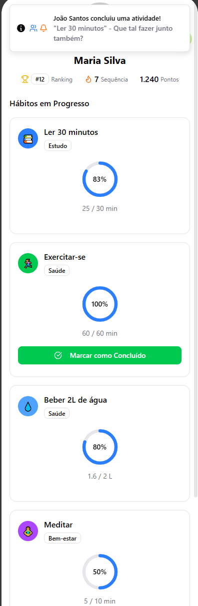
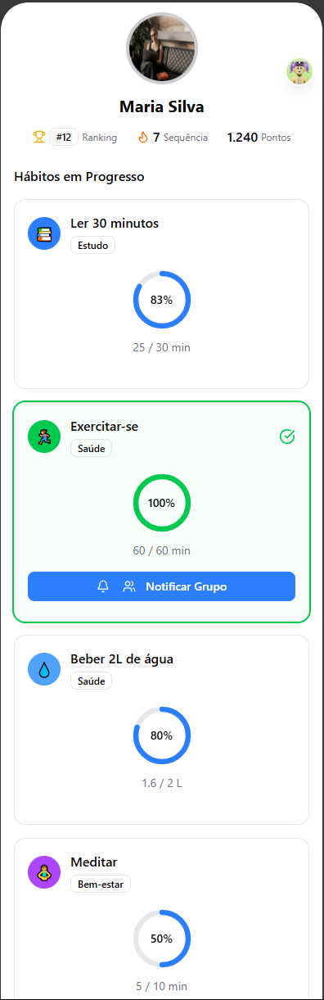
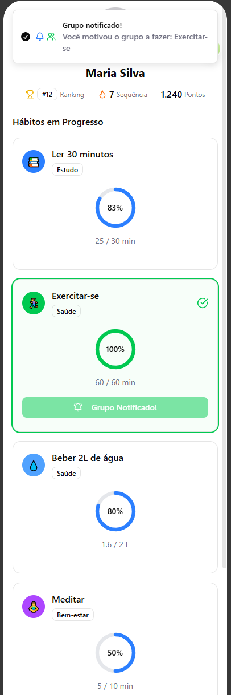
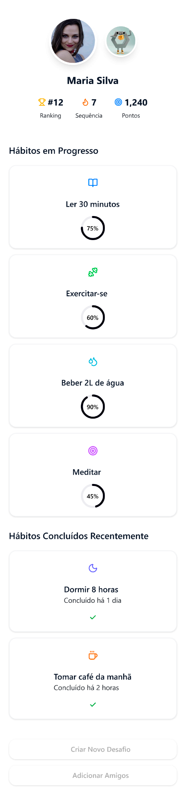
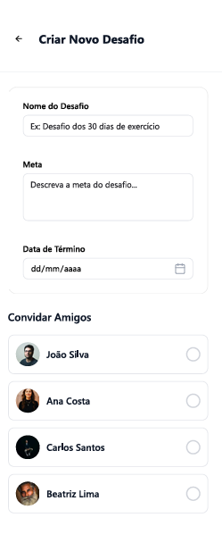
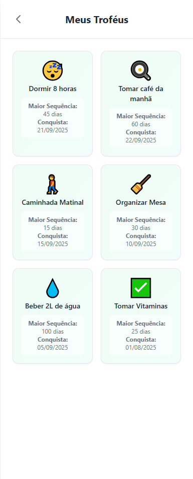
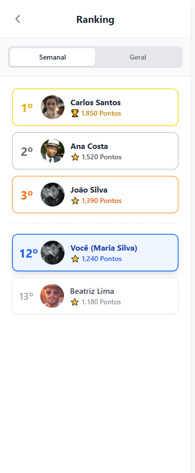

# Documento de Requisitos - Versão 1

## Objetivo do Projeto

Muitas pessoas enfrentam uma dificuldade constante em manter o foco e a disciplina necessários para construir hábitos positivos a longo prazo. A ausência de motivação contínua e de uma rede de apoio eficaz são as principais barreiras que frequentemente levam ao abandono de importantes objetivos pessoais, criando um ciclo de frustração.

Para enfrentar esse desafio, o projeto propõe o desenvolvimento de um software que utiliza a gamificação como principal ferramenta de engajamento. Através de sistemas de pontos, níveis e recompensas, a plataforma transforma o acompanhamento de metas em uma experiência lúdica, fortalecida pela interação social que incentiva uma competição saudável e um senso de responsabilidade mútua entre amigos.

O objetivo final é criar um ambiente digital que torne o desenvolvimento pessoal mais atraente e sustentável. Ao unir a tecnologia com a interação social positiva, o software visa ser um catalisador para a disciplina e o foco, ajudando os usuários a alcançarem seus objetivos de forma consistente e motivadora.

## Levantamento de Requisitos

### Metodologia de Elicitação

Nossa abordagem para elicitação de requisitos combinou técnicas qualitativas com base teórica sólida:

1. **Entrevistas com usuários potenciais**: Realizamos entrevistas estruturadas com 6 pessoas usando um roteiro cuidadosamente elaborado para explorar:
   - Hábitos que tentam manter
   - Fatores de sucesso e fracasso na manutenção de hábitos
   - Preferências quanto a elementos de gamificação
   - Necessidades de interação social e privacidade
   - Preferências de notificação e lembretes

2. **Pesquisa bibliográfica**: Analisamos artigos acadêmicos e reportagens sobre:
   - Princípios de gamificação e seu impacto na motivação
   - Validação prática em aplicações similares
   - Fundamentação psicológica na Teoria da Autodeterminação

### Insights das Entrevistas

Os principais insights obtidos das entrevistas foram:

1. **Fatores de abandono de hábitos**:
   - Falta de motivação contínua (avaliada entre 4-5/5 em importância)
   - Falta de apoio social (avaliada entre 2-4/5)
   - Dificuldade em retomar após interrupções

2. **Preferências de gamificação**:
   - Streaks (sequências) e missões foram os elementos mais valorizados
   - Opiniões divididas sobre o uso de "coringas" para manter streaks

3. **Interação social**:
   - Preferência por compartilhamento com círculo próximo (amigos/família)
   - Divisão entre preferências por competição vs. cooperação

4. **Privacidade**:
   - Forte desejo de controlar quais hábitos são visíveis para outros
   - Preocupação com julgamento externo

## Histórias de Usuário

### Histórias de Gabriel

1. **Notificações de Colocação em Streak**
   - **Como** usuário, **eu quero** que o aplicativo me notifique assim que eu alcançar uma nova colocação num streak, **para** aumentar a minha motivação.

2. **Visualização Integrada de Objetivos e Streaks**
   - **Como** usuário, **eu quero** ver meus objetivos e streaks juntos, **para** ter maior entendimento e visualizar quais objetivos estão ativos.

3. **Notificações para Atividades em Grupo**
   - **Como** usuário, **eu quero** ter a possibilidade de enviar uma notificação para que todos os outros usuários do grupo também façam uma atividade no momento, **para** que todos possam se motivar e apoiar uns aos outros.

### Histórias de Leonardo

1. **Notificações de Hábitos**
   - **Como** estudante, **gostaria** de ser lembrado diariamente dos meus hábitos ativos ainda não completados, **para** manter uma maior constância.

2. **Ranking de Amigos**
   - **Como** usuário do aplicativo, **gostaria** de visualizar um ranking com meus amigos, **para** promover um incentivo maior devido à competição.

3. **Carta Coringa para Hábitos**
   - **Como** usuário, **gostaria** da existência de um coringa **para** não perder o progresso devido a imprevistos.

### Histórias de Tiago

1. **Desafios em Grupo**
   - **Como** usuário, **eu quero** criar desafios em grupo, **para** poder competir ou colaborar com meus amigos.

2. **Hábitos Privados**
   - **Como** usuário, **eu quero** deixar alguns hábitos privados, **para que** meus amigos não vejam tudo o que eu estou fazendo.

3. **Troféus por Conquista**
   - **Como** usuário, **eu quero** marcar um hábito como "concluído", **para que** ele saia da minha lista diária e vire um troféu.

## Diagramas de Sequência

Os diagramas de sequência foram desenvolvidos para representar os fluxos de interação mais importantes do sistema:

1. **Diagrama de Gabriel**: Representa o fluxo de notificações e interações sociais
   

---

2. **Diagrama de Leonardo**: Ilustra o sistema de carta coringa para manutenção de streaks
   

---

3. **Diagrama de Tiago**: Mostra o fluxo de desafios em grupo e troféus

[Referência aos diagramas na pasta Diagramas]

## Demonstração de Protótipo

Desenvolvemos protótipos de média fidelidade que ilustram as principais funcionalidades:

### Protótipo de Gabriel
1.  **Perfil do Usuário**
   
    

2.  **Progresso de Hábitos**
   
    

3.  **Hábito Marcado como Concluído**
   
    

4.  **Notificação Enviada**
   
    

---

### Protótipo de Leonardo
- Sistema de carta coringa e visualização de hábitos

---

### Protótipo de Tiago
# Fluxo de Telas do Aplicativo

1.  **Tela de Perfil**

    

3.  **Tela de Criação de Desafio**

    

4.  **Tela Meus Troféus**

    

5.  **Tela de Edição de Hábito**

    

6.  **Tela de Ranking**

     

