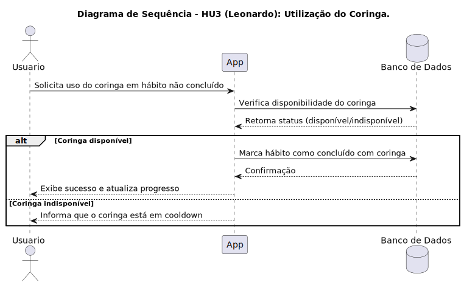

## História de Usuário 1
- **Como** estudante, **gostaria** de ser lembrado diariamente dos meus hábitos ativos ainda não completados, **para** manter uma maior constância.  

### Critérios de Aceitação
- Receber notificações diárias.  
- Hábitos já realizados no dia não devem aparecer na notificação.  

---

## História de Usuário 2
- **Como** usuário do aplicativo, **gostaria** de visualizar um ranking com meus amigos, **para** promover um incentivo maior devido à competição.  

### Critérios de Aceitação
- Visualização do ranking das pessoas adicionadas.  
- Manutenção do ranking através da alteração de pontuação.  

---

## História de Usuário 3
- **Como** usuário, **gostaria** da existência de um coringa **para** não perder o progresso devido a imprevistos.  
### Critérios de Aceitação
- Coringa limitado que volta somente após um tempo.  
- Só pode ser usado em um hábito não concluído.  

