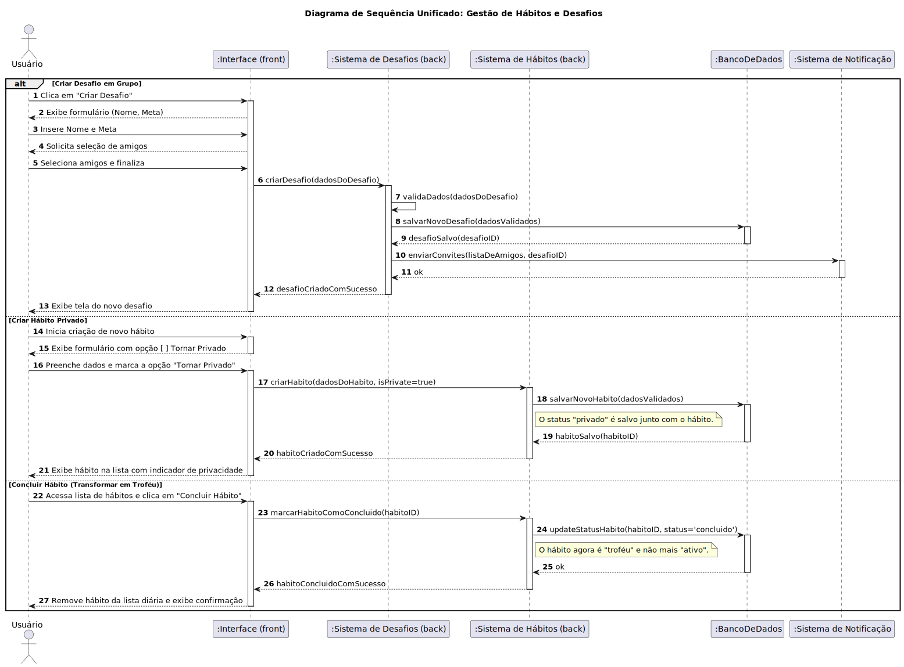

### História 1: Desafios em Grupo

* **Como** usuário, **eu quero** criar desafios em grupo, **para** poder competir ou colaborar com meus amigos.

#### Critérios de Aceitação
1.  Deve existir um botão visível para "Criar Desafio" na interface principal ou na área social.
2.  Ao criar um desafio, o usuário deve poder definir um nome, uma meta clara (ex: "Correr 20 km no total") e uma data de término.
3.  O criador do desafio deve poder selecionar amigos de uma lista para enviar os convites.
4.  Os amigos convidados devem receber uma notificação para aceitar ou recusar a participação no desafio.
5.  Deve haver uma tela específica para cada desafio, onde todos os participantes possam visualizar o progresso individual e coletivo em direção à meta.

---

### História 2: Hábitos Privados

* **Como** usuário, **eu quero** deixar alguns hábitos privados, **para que** meus amigos não vejam tudo o que eu estou fazendo.

#### Critérios de Aceitação
1.  Na tela de criação ou edição do hábito, deve haver uma opção clara (como um checkbox ou switch) para marcar o hábito como "Privado".
2.  Um hábito privado não deve aparecer no feed de atividades públicas dos amigos ou em qualquer ranking compartilhado.
3.  Na lista pessoal de hábitos do usuário, os hábitos privados devem ser identificados com um ícone distinto (ex: um cadeado).
4.  A pontuação e as sequências (streaks) de um hábito privado não devem ser contabilizadas em desafios públicos ou rankings competitivos.
5.  O usuário deve poder alterar a privacidade de um hábito (de público para privado e vice-versa) a qualquer momento.

---

### História 3: Troféus por Conquista

* **Como** usuário, **eu quero** marcar um hábito como "concluído", **para que** ele saia da minha lista diária e vire um troféu.

#### Critérios de Aceitação
1.  Todo hábito ativo deve ter uma opção acessível para ser marcado como "Concluído" ou "Arquivado".
2.  Ao ser marcado como concluído, o hábito deve ser removido da lista de tarefas diárias para não gerar mais notificações.
3.  O hábito concluído deve ser movido para uma seção separada chamada "Troféus" ou "Conquistas" no perfil do usuário.
4.  Na seção de troféus, o hábito deve exibir um resumo do desempenho, como a maior sequência (streak) alcançada e a data de conclusão.
5.  O usuário deve ter a opção de "reativar" um troféu, movendo o hábito de volta para a lista de atividades diárias.

---
### Diagrama de Sequência

