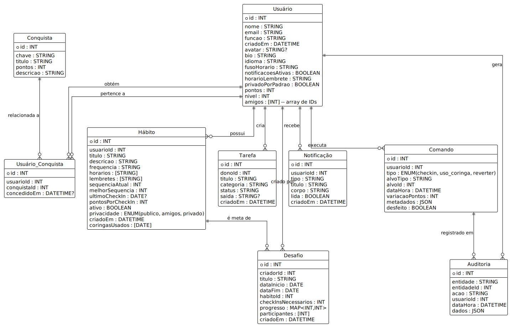

Aqui está a documentação completa em Markdown (`.md`), com o código PlantUML removido e substituído por um link para a imagem `der.svg` na mesma pasta.

-----

# 📘 Documentação do Banco de Dados (`db.json`)

## 1\. Visão Geral

Este documento descreve a estrutura, entidades e regras de negócio do banco de dados do projeto. O banco de dados é um único arquivo (`db.json`) que funciona como um banco de dados NoSQL (baseado em documentos), mas que adere a princípios de design relacional.

Toda a lógica de acesso, escrita e validação de regras de negócio é controlada pela API (`server.js`) através das funções de repositório definidas em `db.js`.

## 2\. Diagrama da Estrutura (DER)

O diagrama abaixo representa as entidades (coleções) e seus relacionamentos principais, conforme a estrutura definida.

-----

## 3\. Detalhamento das Entidades (Coleções)

Esta seção descreve cada entidade (coleção) definida no `db.json`.

### `Usuário` (usuarios)

  * **Descrição:** Entidade central do sistema. Armazena todos os dados do usuário, seu perfil, configurações e progresso de gamificação.
  * **Atributos:**
      * `id` (PK): Identificador único (INT).
      * `nome`: Nome de exibição (STRING).
      * `email`: Email único de login (STRING).
      * `funcao`: Papel no sistema (ex: `maintainer`, `developer`) (STRING).
      * `criadoEm`: Data/hora de criação (DATETIME).
      * `avatar`: URL para a imagem de perfil (STRING, opcional).
      * `bio`: Descrição do perfil (STRING).
      * `idioma`: Preferência de idioma (ex: `pt-BR`) (STRING).
      * `fusoHorario`: Fuso horário do usuário (ex: `America/Sao_Paulo`) (STRING).
      * `notificacoesAtivas`: Preferência de notificação (BOOLEAN).
      * `horarioLembrete`: Horário padrão para lembretes (STRING).
      * `privadoPorPadrao`: Preferência de privacidade para novos hábitos (BOOLEAN).
      * `pontos`: Pontuação total de gamificação (INT).
      * `nivel`: Nível atual de gamificação (INT).
      * `amigos`: Lista de IDs de outros `Usuário` (Array de INT).

### `Hábito` (habitos)

  * **Descrição:** Armazena os hábitos que os usuários criam para rastrear.
  * **Atributos:**
      * `id` (PK): Identificador único (INT).
      * `usuarioId` (FK): O `id` do `Usuário` que possui este hábito.
      * `titulo`: Nome do hábito (ex: "Meditar") (STRING).
      * `descricao`: Detalhes opcionais (STRING).
      * `frequencia`: Frequência (ex: `daily`, `weekly`) (STRING).
      * `horarios`: Dias/horários da agenda (Array de STRING).
      * `lembretes`: Horários para lembretes (Array de STRING).
      * `sequenciaAtual`: Nº de check-ins consecutivos (INT).
      * `melhorSequencia`: Recorde de check-ins (INT).
      * `ultimoCheckIn`: Data do último check-in (DATE, opcional).
      * `pontosPorCheckIn`: Pontos ganhos por check-in (INT).
      * `ativo`: Hábito ativo ou arquivado (BOOLEAN).
      * `privacidade`: Visibilidade (`publico`, `amigos`, `privado`) (ENUM).
      * `criadoEm`: Data/hora de criação (DATETIME).
      * `coringasUsados`: Datas (ISO) em que o "coringa" foi usado (Array de DATE).

### `Tarefa` (tarefas)

  * **Descrição:** Tarefas internas de gestão do projeto (não visíveis aos usuários finais).
  * **Atributos:**
      * `id` (PK): Identificador único (INT).
      * `donoId` (FK): O `id` do `Usuário` responsável pela tarefa.
      * `titulo`: Descrição da tarefa (STRING).
      * `categoria`: Categoria (ex: `documentação`, `gestão`) (STRING).
      * `status`: Estado atual (ex: `todo`, `done`) (STRING).
      * `saida`: Caminho para um artefato/documento (STRING, opcional).
      * `criadoEm`: Data/hora de criação (DATETIME).

### `Desafio` (desafios)

  * **Descrição:** Desafios de gamificação entre múltiplos usuários, baseados em hábitos.
  * **Atributos:**
      * `id` (PK): Identificador único (INT).
      * `criadorId` (FK): O `id` do `Usuário` que criou o desafio.
      * `titulo`: Nome do desafio (STRING).
      * `dataInicio` / `dataFim`: Período do desafio (DATE).
      * `habitoId` (FK): O `id` do `Hábito` que é a meta do desafio.
      * `checkInsNecessarios`: Nº de check-ins para completar (INT).
      * `progresso`: Mapeamento de progresso (`{ usuarioId: contagem }`) (MAP).
      * `participantes`: Lista de IDs de `Usuário` participando (Array de INT).
      * `criadoEm`: Data/hora de criação (DATETIME).

### `Conquista` (conquistas)

  * **Descrição:** Tabela estática que define todas as conquistas possíveis no sistema.
  * **Atributos:**
      * `id` (PK): Identificador único (INT).
      * `chave`: Chave de código (ex: `first_checkin`) (STRING).
      * `titulo`: Nome da conquista (STRING).
      * `pontos`: Pontos de bônus ao ser concedida (INT).
      * `descricao`: Critério de obtenção (STRING).

### `Usuário_Conquista` (usuario\_conquista)

  * **Descrição:** Tabela de junção (Muitos-para-Muitos) que liga `Usuário` a `Conquista`. Registra quais conquistas um usuário já ganhou.
  * **Atributos:**
      * `id` (PK): Identificador único (INT).
      * `usuarioId` (FK): O `id` do `Usuário` que ganhou.
      * `conquistaId` (FK): O `id` da `Conquista` que foi ganha.
      * `concedidoEm`: Data/hora em que foi concedida (DATETIME, opcional).

### `Notificação` (notificacoes)

  * **Descrição:** Armazena notificações (lembretes, sociais, etc.) a serem exibidas para o usuário.
  * **Atributos:**
      * `id` (PK): Identificador único (INT).
      * `usuarioId` (FK): O `id` do `Usuário` que receberá a notificação.
      * `tipo`: Tipo de notificação (ex: `reminder`, `social`, `task`) (STRING).
      * `titulo`: Título (STRING).
      * `corpo`: Texto da notificação (STRING).
      * `lida`: Status de leitura (BOOLEAN).
      * `criadoEm`: Data/hora de criação (DATETIME).

### `Comando` (comandos)

  * **Descrição:** Entidade central da lógica de negócios. Registra cada ação atômica que modifica o estado do sistema (Padrão Command).
  * **Atributos:**
      * `id` (PK): Identificador único (INT).
      * `usuarioId` (FK): O `id` do `Usuário` que executou o comando.
      * `tipo`: Tipo de comando (`checkin`, `uso_coringa`, `reverter`) (ENUM).
      * `alvoTipo`: A entidade alvo (ex: `habit`, `command`) (STRING).
      * `alvoId`: O `id` da entidade alvo (INT).
      * `dataHora`: Data/hora exata da execução (DATETIME).
      * `variacaoPontos`: A variação de pontos que esta ação causou (INT).
      * `metadados`: Dados extras (ex: `{ source: 'mobile' }`) (JSON).
      * `desfeito`: `true` se este comando foi revertido (BOOLEAN).

### `Auditoria` (auditoria)

  * **Descrição:** Tabela de log (1-para-1 com `Comando`) que armazena os detalhes de um comando para fins de auditoria e rastreabilidade.
  * **Atributos:**
      * `id` (PK): Identificador único (INT).
      * `entidade`: A entidade logada (sempre `"comandos"`) (STRING).
      * `entidadeId` (FK): O `id` do `Comando` associado.
      * `acao`: Ação realizada (sempre `"create"`) (STRING).
      * `usuarioId` (FK): O `id` do `Usuário` que executou.
      * `dataHora`: Data/hora da auditoria (DATETIME).
      * `dados`: Cópia dos dados principais do comando (JSON).

-----

## 4\. Lógica de Negócio Chave (extraída de `db.js`)

A lógica de negócios é centralizada em duas funções principais:

### 4.1. `executeCommand(command)`

Esta é a função principal que modifica o estado do banco de dados.

  * **`checkin`:**

      * Verifica se o hábito existe e se já não houve check-in hoje. Se sim, retorna um erro.
      * Atualiza `lastCheckIn` para hoje e incrementa `streak` (sequência atual) e `bestStreak` (melhor sequência).
      * Soma os `pointsPerCheckIn` do hábito aos `stats.points` do usuário.
      * Atualiza o `progress` nos `Desafios` (`challenges`) dos quais o usuário participa e que monitoram este hábito.
      * Concede a conquista `first_checkin` (id: 1) se for a primeira vez.
          * **Nota de Implementação:** A lógica em `db.js` ainda usa o modelo antigo `userAchievements` (array de IDs). Para se alinhar a este diagrama, ela precisaria ser refatorada para criar uma nova entrada em `Usuário_Conquista`.

  * **`joker_use` (Uso de Coringa):**

      * Verifica se o coringa já foi usado para aquele hábito na data de hoje. Se sim, retorna um erro.
      * Adiciona a data de hoje ao array `jokerUsedDates` do hábito.
      * A variação de pontos (`pointsDelta`) é `0`.

  * **`revert` (Reverter Ação):**

      * Localiza o comando-alvo (`target.id`) que será desfeito.
      * Verifica se o alvo já não foi desfeito (`undone === true`). Se sim, retorna um erro.
      * Marca o comando-alvo como `undone = true`.
      * Define o `pointsDelta` do comando *revert* como o valor negativo do comando-alvo (ex: `-10`).
      * Se o alvo era um `checkin`, subtrai os pontos dos `stats.points` do usuário e decrementa a `streak` (sequência) do hábito.

  * **Auditoria:**

      * Toda execução de `executeCommand` (checkin, joker ou revert) **automaticamente** cria uma nova entrada na coleção `Auditoria` (`auditLog`) com os detalhes da ação.

### 4.2. `filterHabitsForViewer(viewerId)`

Esta função aplica as regras de privacidade ao buscar hábitos.

  * `privacy: "public"`: Sempre visível.
  * `privacy: "private"`: Visível apenas se `viewerId` for igual ao `userId` do hábito (o dono).
  * `privacy: "friends"`: Visível se o `viewerId` for o dono OU se o `viewerId` estiver listado no array `friends` do dono do hábito.

-----

## 5\. Endpoints da API (extraído de `server.js`)

O `server.js` expõe o `db.js` através dos seguintes endpoints:

### 5.1. Endpoints CRUD Genéricos

O servidor oferece rotas CRUD genéricas para a maioria das coleções:

  * `GET /:collection`: Retorna todos os itens de uma coleção.
  * `GET /:collection/:id`: Retorna um item específico pelo ID.
  * `POST /:collection`: Cria um novo item (com corpo JSON).
  * `PUT /:collection/:id`: Atualiza um item (com corpo JSON).
  * `DELETE /:collection/:id`: Remove um item.

### 5.2. Endpoints de Lógica Específica

  * `POST /commands`

      * **Descrição:** Ponto de entrada principal para *qualquer* ação que modifica o estado (check-in, coringa, reverter).
      * **Função (`db.js`):** `executeCommand(req.body)`.

  * `GET /habits-visible`

      * **Descrição:** Retorna a lista de hábitos que o usuário (`viewerId`) tem permissão para ver.
      * **Função (`db.js`):** `filterHabitsForViewer(req.query.viewerId)`.