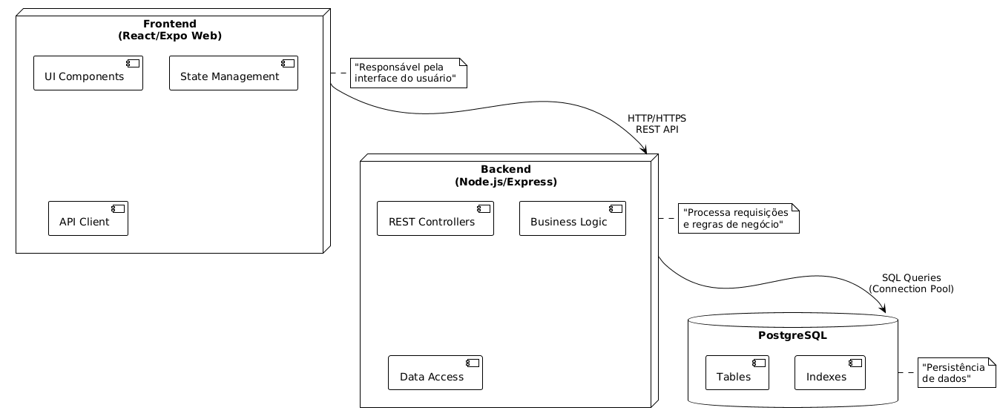
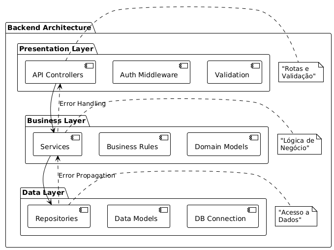

# Decisões de Arquitetura

Este documento detalha as duas principais arquiteturas que formam a base do nosso sistema, justificando suas escolhas e definindo suas implementações.

./[Diagrama Geral](./diagarmaPrincipal.png)

Este diagrama mostra a visão geral da arquitetura, combinando tanto a perspectiva Cliente-Servidor quanto a arquitetura em camadas do Backend. Na parte superior, vemos a comunicação entre Cliente, API e Banco de Dados através de protocolos bem definidos. Na parte inferior, visualizamos as três camadas do Backend e como os erros são propagados de baixo para cima.

## 1. Arquitetura Cliente-Servidor

### Contexto
O projeto requer uma separação clara entre a interface do usuário (Frontend) e a lógica de negócios (Backend). Precisávamos de uma forma de comunicação padronizada, escalável e independente, que permitisse ao cliente (React/Expo Web) consumir dados e executar ações no servidor (Node.js) de forma `stateless`.

### Implementação
A arquitetura é composta por três componentes principais:

* **Cliente (React/Expo Web):**
    * Responsável por toda a interface do usuário e gerenciamento de estado local.
    * Comunica-se com a API via requisições HTTP/HTTPS (GET, POST, etc.).

* **API (Node.js/Express):**
    * Processa todas as requisições do cliente.
    * Implementa a lógica de negócios, gerencia autenticação e autorização.
    * Serve como intermediário para o banco de dados.

* **Banco de Dados (PostgreSQL):**
    * Armazena e persiste todos os dados da aplicação (usuários, hábitos, pontuações).

### Benefícios Comprovados
1.  **Separação de Responsabilidades:** O Frontend (UI) está totalmente desacoplado do Backend (lógica), permitindo que as equipes trabalhem de forma independente.
2.  **Escalabilidade:** O Backend pode ser escalado para múltiplos servidores sem afetar o Cliente.
3.  **Interface Padrão (REST):** O uso de uma API RESTful `stateless` fornece um contrato claro e padronizado para a comunicação.

### Diagrama da Arquitetura Cliente-Servidor

**Explicação do Diagrama:**
O diagrama ilustra a separação clara entre os três componentes principais do sistema. O Cliente (React/Expo) comunica-se com a API (Node.js) através de requisições HTTP/HTTPS REST, enquanto a API se comunica com o PostgreSQL através de um pool de conexões SQL. As setas indicam o fluxo de dados e as responsabilidades estão claramente delimitadas por componente.

---

## 2. Arquitetura em Camadas (Backend)

### Contexto
Para o Backend (API), era necessário um padrão de organização interna que evitasse o acoplamento da lógica de negócios com a lógica de acesso a dados ou com as definições de rotas (controllers). O objetivo principal era garantir alta manutenibilidade e testabilidade.

### Implementação
O servidor API é organizado em três camadas lógicas distintas:

* **Camada de Apresentação (Superior):**
    * Recebe as requisições HTTP e envia as respostas.
    * Contém os `Controllers` da API, `Middleware` de autenticação e `Validação` de requisições.

* **Camada de Negócios (Meio):**
    * Contém a lógica central da aplicação (regras de negócio).
    * Inclui os `Serviços` (ex: `HabitService`), lógica de gamificação e regras de hábitos.
    * Orquestra as operações na camada de dados.

* **Camada de Dados (Inferior):**
    * Abstrai o acesso ao banco de dados.
    * Contém os `Repositories` (Padrão de Projeto), `Models` e a lógica de conexão com o PostgreSQL.

### Benefícios Comprovados
1.  **Organização e Manutenibilidade:** O código é organizado por responsabilidade, tornando-o mais fácil de manter e entender.
2.  **Testabilidade:** Cada camada pode ser testada de forma isolada (ex: testar os `Serviços` da camada de negócios "mocando" os `Repositories` da camada de dados).
3.  **Flexibilidade:** Mudanças em uma camada (ex: otimizar uma query SQL na Camada de Dados) não afetam as outras camadas (como a Camada de Negócios).

### Diagrama da Arquitetura em Camadas

**Explicação do Diagrama:**
O diagrama mostra a estrutura em camadas do Backend, com as três camadas principais (Apresentação, Negócios e Dados) e suas responsabilidades. As setas sólidas indicam o fluxo normal de dados de cima para baixo, enquanto as setas tracejadas mostram como os erros são propagados de baixo para cima através das camadas. Cada camada só se comunica com as camadas adjacentes, mantendo um baixo acoplamento.