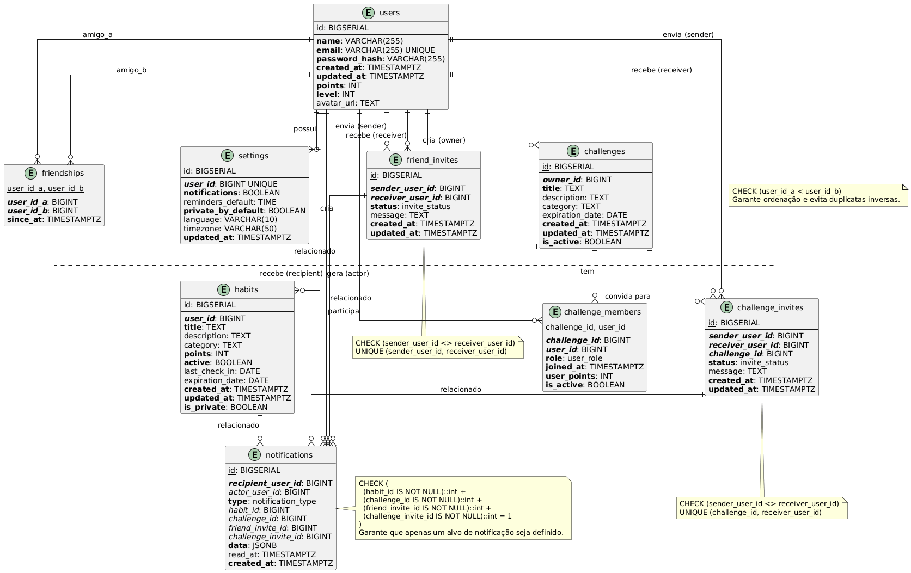

# Documentação do Banco de Dados (PostgreSQL)

## 1\. Visão Geral

Este documento descreve a estrutura, entidades (tabelas) e regras de negócio do banco de dados do projeto. O banco de dados é um schema PostgreSQL, e sua estrutura é definida pelo script `constraints.sql`.

Este schema utiliza chaves primárias (`BIGSERIAL`), chaves estrangeiras (`REFERENCES`) com ações em cascata (`ON DELETE CASCADE`) para garantir a integridade relacional, `ENUM`s customizados para tipos de dados controlados, `CHECK` constraints para regras de negócio no nível do banco e Índices para otimização de performance.

## 2\. Diagrama da Estrutura (DER)

O diagrama abaixo representa as entidades (tabelas) e seus relacionamentos principais, conforme a estrutura definida.

-----

## 3\. Tipos Customizados (ENUMs)

O schema define tipos de dados customizados para garantir a consistência de valores específicos.

  * **`invite_status`**
      * **Descrição:** Status possíveis para convites (amizade e desafios).
      * **Valores:** `PENDING`, `ACCEPTED`, `REJECTED`, `CANCELLED`.
  * **`notification_type`**
      * **Descrição:** Tipos de notificações do sistema.
      * **Valores:** `FRIEND_REQUEST`, `FRIEND_ACCEPTED`, `CHALLENGE_INVITE`, `CHALLENGE_JOINED`, `HABIT_REMINDER`, `ACHIEVEMENT`, `LEVEL_UP`.
  * **`user_role`**
      * **Descrição:** Papéis de usuários em desafios.
      * **Valores:** `ADMIN`, `MEMBER`, `MODERATOR`.

-----

## 4\. Detalhamento das Entidades (Tabelas)

Esta seção descreve cada entidade (tabela) definida no `constraints.sql`.

### `Usuário` (users)

  * **Descrição:** Tabela de usuários do sistema.
  * **Atributos:**
      * `id` (PK): Identificador único do usuário (BIGSERIAL).
      * `name` (NOT NULL): Nome completo do usuário (VARCHAR(255)).
      * `email` (UNIQUE, NOT NULL): Email único do usuário para login (VARCHAR(255)).
      * `password_hash` (NOT NULL): Hash da senha do usuário (bcrypt) (VARCHAR(255)).
      * `created_at` (NOT NULL): Data e hora de criação do registro (TIMESTAMPTZ).
      * `updated_at` (NOT NULL): Data e hora da última atualização (TIMESTAMPTZ).
      * `points` (NOT NULL): Pontuação total acumulada pelo usuário (INT).
      * `level` (NOT NULL): Nível atual do usuário baseado em pontos (INT).
      * `avatar_url`: URL da imagem de perfil do usuário (TEXT).

### `Configurações` (settings)

  * **Descrição:** Configurações personalizadas de cada usuário.
  * **Atributos:**
      * `id` (PK): Identificador único da configuração (BIGSERIAL).
      * `user_id` (FK, UNIQUE, NOT NULL): Referência ao usuário dono das configurações (BIGINT, REFERENCES `users(id)` ON DELETE CASCADE).
      * `notifications` (NOT NULL): Indica se o usuário deseja receber notificações (BOOLEAN).
      * `reminders_default`: Horário padrão para lembretes de hábitos (TIME).
      * `private_by_default` (NOT NULL): Define se novos hábitos são privados por padrão (BOOLEAN).
      * `language`: Idioma preferido do usuário (VARCHAR(10)).
      * `timezone`: Fuso horário do usuário (VARCHAR(50)).
      * `updated_at` (NOT NULL): Data e hora da última atualização (TIMESTAMPTZ).

### `Hábito` (habits)

  * **Descrição:** Tabela de hábitos criados pelos usuários.
  * **Atributos:**
      * `id` (PK): Identificador único do hábito (BIGSERIAL).
      * `user_id` (FK, NOT NULL): Referência ao usuário dono do hábito (BIGINT, REFERENCES `users(id)` ON DELETE CASCADE).
      * `title` (NOT NULL): Título/nome do hábito (TEXT).
      * `description`: Descrição detalhada do hábito (TEXT).
      * `category`: Categoria do hábito (saúde, produtividade, etc) (TEXT).
      * `points` (NOT NULL): Pontos ganhos ao completar o hábito (INT).
      * `active` (NOT NULL): Indica se o hábito está ativo (BOOLEAN).
      * `last_check_in`: Data do último check-in realizado (DATE).
      * `expiration_date`: Data de expiração/término do hábito (DATE).
      * `created_at` (NOT NULL): Data e hora de criação do hábito (TIMESTAMPTZ).
      * `updated_at` (NOT NULL): Data e hora da última atualização (TIMESTAMPTZ).
      * `is_private` (NOT NULL): Define se o hábito é privado ou público (BOOLEAN).

### `Desafio` (challenges)

  * **Descrição:** Tabela de desafios criados pelos usuários.
  * **Atributos:**
      * `id` (PK): Identificador único do desafio (BIGSERIAL).
      * `owner_id` (FK, NOT NULL): Referência ao usuário criador do desafio (BIGINT, REFERENCES `users(id)` ON DELETE CASCADE).
      * `title` (NOT NULL): Título do desafio (TEXT).
      * `description`: Descrição detalhada do desafio (TEXT).
      * `category`: Categoria do desafio (TEXT).
      * `expiration_date`: Data de término do desafio (DATE).
      * `created_at` (NOT NULL): Data e hora de criação do desafio (TIMESTAMPTZ).
      * `updated_at` (NOT NULL): Data e hora da última atualização (TIMESTAMPTZ).
      * `is_active` (NOT NULL): Indica se o desafio está ativo (BOOLEAN).

### `Membros de Desafios` (challenge\_members)

  * **Descrição:** Tabela de relacionamento (N-N) entre desafios e seus membros.
  * **Atributos:**
      * `challenge_id` (PK, FK): Referência ao desafio (BIGINT, REFERENCES `challenges(id)` ON DELETE CASCADE).
      * `user_id` (PK, FK): Referência ao usuário membro (BIGINT, REFERENCES `users(id)` ON DELETE CASCADE).
      * `role` (NOT NULL): Papel do usuário no desafio (`user_role`).
      * `joined_at` (NOT NULL): Data e hora em que o usuário entrou no desafio (TIMESTAMPTZ).
      * `user_points` (NOT NULL): Pontos acumulados pelo usuário neste desafio (INT).
      * `is_active` (NOT NULL): Indica se o membro está ativo no desafio (BOOLEAN).

### `Amizades` (friendships)

  * **Descrição:** Tabela de relacionamento (N-N) de amizades entre usuários.
  * **Atributos:**
      * `user_id_a` (PK, FK): Referência ao primeiro usuário da amizade (menor ID) (BIGINT, REFERENCES `users(id)` ON DELETE CASCADE).
      * `user_id_b` (PK, FK): Referência ao segundo usuário da amizade (maior ID) (BIGINT, REFERENCES `users(id)` ON DELETE CASCADE).
      * `since_at` (NOT NULL): Data e hora em que a amizade foi estabelecida (TIMESTAMPTZ).
  * **Constraints:**
      * `CHECK (user_id_a < user_id_b)`: Garante que os pares sejam únicos e ordenados para evitar duplicidade (A-B e B-A).

### `Convites de Amizade` (friend\_invites)

  * **Descrição:** Tabela de convites de amizade entre usuários.
  * **Atributos:**
      * `id` (PK): Identificador único do convite (BIGSERIAL).
      * `sender_user_id` (FK, NOT NULL): Referência ao usuário que enviou o convite (BIGINT, REFERENCES `users(id)` ON DELETE CASCADE).
      * `receiver_user_id` (FK, NOT NULL): Referência ao usuário que recebeu o convite (BIGINT, REFERENCES `users(id)` ON DELETE CASCADE).
      * `status` (NOT NULL): Status atual do convite (`invite_status`).
      * `message`: Mensagem opcional enviada com o convite (TEXT).
      * `created_at` (NOT NULL): Data e hora de criação do convite (TIMESTAMPTZ).
      * `updated_at` (NOT NULL): Data e hora da última atualização do status (TIMESTAMPTZ).
  * **Constraints:**
      * `CHECK (sender_user_id <> receiver_user_id)`: Um usuário não pode enviar um convite para si mesmo.
      * `UNIQUE (sender_user_id, receiver_user_id)`: Impede que um usuário envie múltiplos convites pendentes para o mesmo destinatário.

### `Convites de Desafio` (challenge\_invites)

  * **Descrição:** Tabela de convites para participação em desafios.
  * **Atributos:**
      * `id` (PK): Identificador único do convite (BIGSERIAL).
      * `sender_user_id` (FK, NOT NULL): Referência ao usuário que enviou o convite (BIGINT, REFERENCES `users(id)` ON DELETE CASCADE).
      * `receiver_user_id` (FK, NOT NULL): Referência ao usuário que recebeu o convite (BIGINT, REFERENCES `users(id)` ON DELETE CASCADE).
      * `challenge_id` (FK, NOT NULL): Referência ao desafio para o qual foi convidado (BIGINT, REFERENCES `challenges(id)` ON DELETE CASCADE).
      * `status` (NOT NULL): Status atual do convite (`invite_status`).
      * `message`: Mensagem opcional enviada com o convite (TEXT).
      * `created_at` (NOT NULL): Data e hora de criação do convite (TIMESTAMPTZ).
      * `updated_at` (NOT NULL): Data e hora da última atualização do status (TIMESTAMPTZ).
  * **Constraints:**
      * `CHECK (sender_user_id <> receiver_user_id)`: Um usuário não pode convidar a si mesmo.
      * `UNIQUE (challenge_id, receiver_user_id)`: Impede que um usuário seja convidado múltiplas vezes para o mesmo desafio.

### `Notificações` (notifications)

  * **Descrição:** Tabela de notificações do sistema para usuários.
  * **Atributos:**
      * `id` (PK): Identificador único da notificação (BIGSERIAL).
      * `recipient_user_id` (FK, NOT NULL): Referência ao usuário que receberá a notificação (BIGINT, REFERENCES `users(id)` ON DELETE CASCADE).
      * `actor_user_id` (FK): Referência ao usuário que gerou o evento (pode ser nulo) (BIGINT, REFERENCES `users(id)` ON DELETE SET NULL).
      * `type` (NOT NULL): Tipo da notificação (`notification_type`).
      * `habit_id` (FK): Referência opcional ao hábito relacionado (BIGINT, REFERENCES `habits(id)` ON DELETE CASCADE).
      * `challenge_id` (FK): Referência opcional ao desafio relacionado (BIGINT, REFERENCES `challenges(id)` ON DELETE CASCADE).
      * `friend_invite_id` (FK): Referência opcional ao convite de amizade relacionado (BIGINT, REFERENCES `friend_invites(id)` ON DELETE CASCADE).
      * `challenge_invite_id` (FK): Referência opcional ao convite de desafio relacionado (BIGINT, REFERENCES `challenge_invites(id)` ON DELETE CASCADE).
      * `data` (NOT NULL): Dados extras em formato JSON para informações adicionais (JSONB).
      * `read_at`: Data e hora em que a notificação foi lida (nulo se não lida) (TIMESTAMPTZ).
      * `created_at` (NOT NULL): Data e hora de criação da notificação (TIMESTAMPTZ).
  * **Constraints:**
      * `CHECK (...)`: Garante que a notificação aponte para apenas *um* alvo (hábito, desafio, convite de amizade ou convite de desafio).

-----

## 5\. Índices (Otimização)

Índices são usados para acelerar consultas em colunas frequentemente buscadas ou ordenadas.

  * **`users`**
      * `idx_users_email`: Otimiza a busca rápida por email (ex: login).
      * `idx_users_level`: Otimiza a busca por nível.
      * `idx_users_points`: Otimiza a ordenação por pontuação (ex: rankings).
  * **`habits`**
      * `idx_habits_user_id`: Otimiza a busca de hábitos por usuário.
      * `idx_habits_active`: Otimiza a filtragem por hábitos ativos.
      * `idx_habits_category`: Otimiza a filtragem por categoria.
      * `idx_habits_expiration`: Otimiza a busca por hábitos que expiram.
  * **`challenges`**
      * `idx_challenges_owner_id`: Otimiza a busca de desafios por criador.
      * `idx_challenges_category`: Otimiza a filtragem por categoria.
      * `idx_challenges_active`: Otimiza a filtragem por desafios ativos.
      * `idx_challenges_expiration`: Otimiza a busca por desafios que expiram.
  * **`challenge_members`**
      * `idx_challenge_members_user_id`: Otimiza a busca de desafios dos quais um usuário participa.
      * `idx_challenge_members_points`: Otimiza o ranking de pontuação *dentro* de um desafio.
  * **`friendships`**
      * `idx_friendships_user_a` / `idx_friendships_user_b`: Otimizam buscas de amigos de um usuário.
  * **`friend_invites`**
      * `idx_friend_invites_sender`: Otimiza busca de convites enviados.
      * `idx_friend_invites_receiver`: Otimiza busca de convites recebidos.
      * `idx_friend_invites_status`: Otimiza busca por convites pendentes.
  * **`challenge_invites`**
      * `idx_challenge_invites_sender`: Otimiza busca de convites enviados.
      * `idx_challenge_invites_receiver`: Otimiza busca de convites recebidos.
      * `idx_challenge_invites_challenge`: Otimiza busca de convites por desafio.
      * `idx_challenge_invites_status`: Otimiza busca por convites pendentes.
  * **`notifications`**
      * `idx_notifications_recipient_unread`: Otimiza a busca de notificações não lidas de um usuário (consulta muito frequente).
      * `idx_notifications_type`: Otimiza a filtragem por tipo de notificação.
      * `idx_notifications_created_at`: Otimiza a ordenação por data de criação.

-----

## 6\. Lógica de Negócio Chave (Legado - `db.js`)

> [\!WARNING]
> **Atenção:** A seção a seguir descreve a lógica de negócios da implementação anterior (`db.json` / `db.js`). Ela precisa ser revisada e atualizada para refletir a nova arquitetura SQL (que provavelmente será implementada na camada de aplicação/API, Triggers ou Stored Procedures).

A lógica de negócios é centralizada em duas funções principais:

### 6.1. `executeCommand(command)`

Esta é a função principal que modifica o estado do banco de dados.

  * **`checkin`:**
      * Verifica se o hábito existe e se já não houve check-in hoje. Se sim, retorna um erro.
      * Atualiza `lastCheckIn` para hoje e incrementa `streak` (sequência atual) e `bestStreak` (melhor sequência).
      * Soma os `pointsPerCheckIn` do hábito aos `stats.points` do usuário.
      * Atualiza o `progress` nos `Desafios` (`challenges`) dos quais o usuário participa e que monitoram este hábito.
      * Concede a conquista `first_checkin` (id: 1) se for a primeira vez.
          * **Nota de Implementação:** A lógica em `db.js` ainda usa o modelo antigo `userAchievements` (array de IDs). Para se alinhar a este diagrama, ela precisaria ser refatorada para criar uma nova entrada em `Usuário_Conquista`.
  * **`joker_use` (Uso de Coringa):**
      * Verifica se o coringa já foi usado para aquele hábito na data de hoje. Se sim, retorna um erro.
      * Adiciona a data de hoje ao array `jokerUsedDates` do hábito.
      * A variação de pontos (`pointsDelta`) é `0`.
  * **`revert` (Reverter Ação):**
      * Localiza o comando-alvo (`target.id`) que será desfeito.
      * Verifica se o alvo já não foi desfeito (`undone === true`). Se sim, retorna um erro.
      * Marca o comando-alvo como `undone = true`.
      * Define o `pointsDelta` do comando *revert* como o valor negativo do comando-alvo (ex: `-10`).
      * Se o alvo era um `checkin`, subtrai os pontos dos `stats.points` do usuário e decrementa a `streak` (sequência) do hábito.
  * **Auditoria:**
      * Toda execução de `executeCommand` (checkin, joker ou revert) **automaticamente** cria uma nova entrada na coleção `Auditoria` (`auditLog`) com os detalhes da ação.

### 6.2. `filterHabitsForViewer(viewerId)`

Esta função aplica as regras de privacidade ao buscar hábitos.

  * `privacy: "public"`: Sempre visível.
  * `privacy: "private"`: Visível apenas se `viewerId` for igual ao `userId` do hábito (o dono).
  * `privacy: "friends"`: Visível se o `viewerId` for o dono OU se o `viewerId` estiver listado no array `friends` do dono do hábito.

-----

## 7\. Endpoints da API (Legado - `server.js`)

> [\!WARNING]
> **Atenção:** A seção a seguir descreve os endpoints da API da implementação anterior (`server.js`). Ela precisa ser revisada e atualizada para refletir a nova arquitetura.

O `server.js` expõe o `db.js` através dos seguintes endpoints:

### 7.1. Endpoints CRUD Genéricos

O servidor oferece rotas CRUD genéricas para a maioria das coleções:

  * `GET /:collection`: Retorna todos os itens de uma coleção.
  * `GET /:collection/:id`: Retorna um item específico pelo ID.
  * `POST /:collection`: Cria um novo item (com corpo JSON).
  * `PUT /:collection/:id`: Atualiza um item (com corpo JSON).
  * `DELETE /:collection/:id`: Remove um item.

### 7.2. Endpoints de Lógica Específica

  * `POST /commands`
      * **Descrição:** Ponto de entrada principal para *qualquer* ação que modifica o estado (check-in, coringa, reverter).
      * **Função (`db.js`):** `executeCommand(req.body)`.
  * `GET /habits-visible`
      * **Descrição:** Retorna a lista de hábitos que o usuário (`viewerId`) tem permissão para ver.
      * **Função (`db.js`):** `filterHabitsForViewer(req.query.viewerId)`.