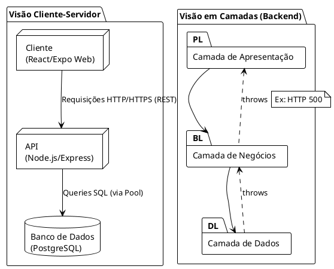
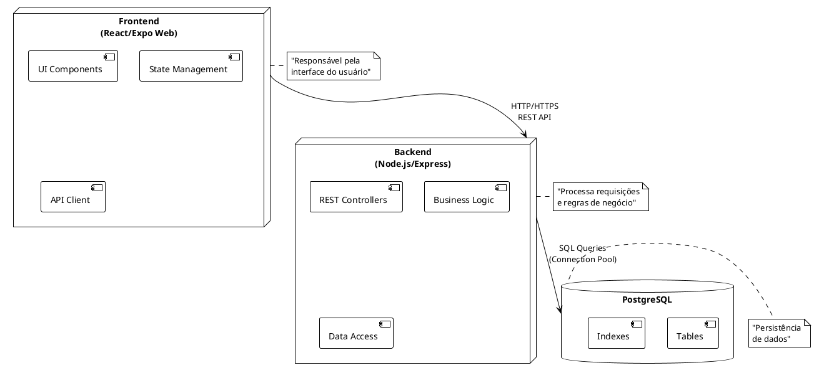
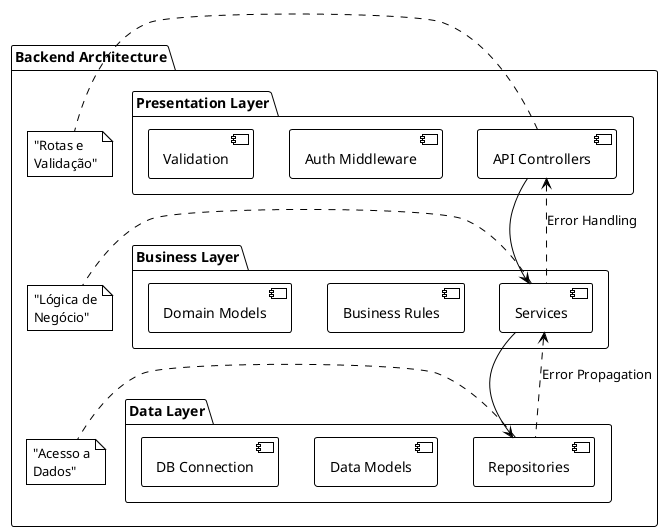
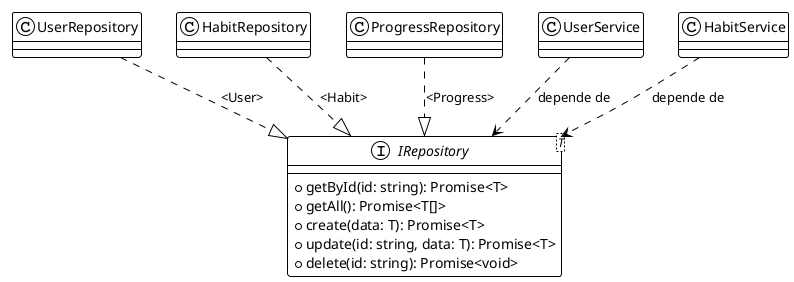

# Arquitetura e Padrões de Projeto

## 1. Arquitetura Principal

### 1.1. Arquiteturas Sugeridas
1. Arquitetura Cliente-Servidor com API RESTful
2. Arquitetura em Camadas (Layered Architecture)

### 1.2. Justificativa
A combinação dessas arquiteturas é ideal para nossa aplicação:

**Cliente-Servidor com REST:**
- Permite clara separação entre frontend e backend
- Facilita escalabilidade e desenvolvimento independente
- API RESTful oferece interface padronizada e stateless
- Ideal para atualizações em tempo real de hábitos e notificações

**Arquitetura em Camadas:**
- Organiza o backend em camadas bem definidas
- Melhora a manutenibilidade e testabilidade
- Separa responsabilidades de forma clara
- Facilita mudanças em camadas específicas sem afetar outras

### 1.3. Componentes do Diagrama de Arquitetura

**Visão Cliente-Servidor:**
- **Cliente (React/Expo Web)**
  - Responsável pela interface do usuário
  - Gerencia estado local e interações
  - Comunica com a API via HTTP/HTTPS

- **API (Node.js/Express)**
  - Processa requisições do cliente
  - Implementa lógica de negócios
  - Gerencia autenticação e autorização
  - Coordena operações no banco de dados

- **Banco de Dados (PostgreSQL)**
  - Armazena dados de usuários, hábitos e pontuações
  - Mantém relacionamentos entre entidades
  - Garante consistência e integridade dos dados

**Elementos do Diagrama:**
1. Desenhe três caixas principais: "Cliente", "API", "Banco de Dados"
2. Setas de comunicação:
   - Cliente → API: "Requisições HTTP/HTTPS (REST)"
   - API → Banco de Dados: "Queries SQL (via Pool)"

**Visão em Camadas (Backend):**
- **Camada de Apresentação**
  - Controllers da API
  - Middleware de autenticação
  - Validação de requisições

- **Camada de Negócios**
  - Serviços de negócios
  - Lógica de gamificação
  - Regras de hábitos

- **Camada de Dados**
  - Repositories
  - Models
  - Conexão com banco de dados

**Elementos do Diagrama:**
1. Desenhe três caixas horizontais sobrepostas:
   - Superior: "Camada de Apresentação"
   - Meio: "Camada de Negócios"
   - Inferior: "Camada de Dados"
2. Setas de dependência:
   - Fluxo de Dados (↓):
     * Apresentação → Negócios → Dados
   - Fluxo de Erros (↑):
     * Dados throws → Negócios throws → Apresentação
     * Exemplo: HabitRepository → HabitService → HabitController (HTTP 500)

**Comunicação:**
- Cliente ↔ API: Requisições HTTP/HTTPS (GET, POST, PUT, DELETE)
- Entre Camadas: Chamadas de método diretas
- API ↔ Banco: Queries SQL via pool de conexões

## 2. Padrões de Projeto

### Frontend Pattern: Container/Presentational

#### 2.1. O que é
Padrão que separa componentes React em dois tipos: Containers (lógica e estado) e Presentational (UI pura).

#### 2.2. Justificativa
Ideal para nossa aplicação pois:
- Separa claramente responsabilidades
- Facilita testes e manutenção
- Permite reutilização de componentes visuais
- Simplifica o gerenciamento de estado

#### 2.3. Diagrama de Implementação
**Elementos do Diagrama:**
1. Hierarquia e Gestão de Estado:
   ```
   HabitContainer
   - Estado: { habits[], isLoading, error }
   - Lógica: fetchHabits(), handleCheckin()
        ↓ 
   HabitList
   - Props: { habits[], isLoading, error, onCheckin }
   - UI: Renderiza loading/error/lista
        ↓ 
   HabitItem
   - Props: { habit, onCheckin }
   - UI: Renderiza apenas o item
   ```

2. Fluxo de Dados:
   - HabitContainer → HabitList: 
     ```
     props: {
       habits: Habit[],
       isLoading: boolean,
       error: Error | null,
       onCheckin: (habitId: string) => void
     }
     ```
   - HabitList → HabitItem: `props: { habit: Habit, onCheckin }`

3. Fluxo de Eventos:
   - HabitItem → HabitContainer: `callback: onCheckin(habitId)`
   - Container gerencia estados de UI:
     * isLoading: true durante fetchHabits()
     * error: captura e exibe erros da API

### Backend Pattern 1: Observer

#### 2.4. O que é
Padrão comportamental onde objetos (observers) são notificados automaticamente quando ocorrem mudanças em outro objeto (subject).

#### 2.5. Justificativa
Perfeito para nosso sistema de notificações pois:
- Permite notificar múltiplos usuários sobre eventos
- Desacopla a lógica de notificação da lógica de negócios
- Facilita adição de novos tipos de notificações

#### 2.6. Diagrama de Implementação
**Elementos do Diagrama:**
1. Interface:
   ```
   IObserver
   + update(data: any)
   ```
2. Classes:
   ```
   NotificationSubject
   + attach(observer: IObserver)
   + detach(observer: IObserver)
   + notify(data: any)
   ```
3. Relações:
   - UserObserver --|> IObserver (implementação)
   - HabitObserver --|> IObserver (implementação)
   - NotificationService <>-- NotificationSubject (agregação)

### Backend Pattern 2: Repository

#### 2.7. O que é
Padrão que abstrai a camada de persistência de dados, encapsulando a lógica de acesso ao banco.

#### 2.8. Justificativa
Essencial para nossa aplicação pois:
- Isola a lógica de acesso ao PostgreSQL
- Facilita testes unitários
- Permite trocar a implementação do banco
- Centraliza queries e operações de dados

#### 2.9. Diagrama de Implementação
**Elementos do Diagrama:**
1. Interface Genérica:
   ```
   IRepository<T>
   + getById(id: string): Promise<T>
   + getAll(): Promise<T[]>
   + create(data: T): Promise<T>
   + update(id: string, data: T): Promise<T>
   + delete(id: string): Promise<void>
   ```
2. Classes Concretas:
   - UserRepository --|> IRepository<User>
   - HabitRepository --|> IRepository<Habit>
   - ProgressRepository --|> IRepository<Progress>
3. Consumidores:
   - UserService --> IRepository<User> (dependência)
   - HabitService --> IRepository<Habit> (dependência)

## Diagramas PlantUML

### Diagrama 1: Arquitetura Principal

**Explicação do Diagrama:**
Este diagrama mostra a visão geral da arquitetura, combinando tanto a perspectiva Cliente-Servidor quanto a arquitetura em camadas do Backend. Na parte superior, vemos a comunicação entre Cliente, API e Banco de Dados através de protocolos bem definidos. Na parte inferior, visualizamos as três camadas do Backend e como os erros são propagados de baixo para cima.

### Diagrama 1A: Arquitetura Cliente-Servidor

**Explicação do Diagrama:**
Este diagrama detalha os componentes internos de cada parte da arquitetura Cliente-Servidor. O Frontend contém componentes UI, gerenciamento de estado e cliente API. O Backend possui controllers REST, lógica de negócios e acesso a dados. As setas mostram o fluxo de dados unidirecional, com o Frontend fazendo requisições REST e o Backend consultando o banco via pool de conexões.

### Diagrama 1B: Arquitetura em Camadas

**Explicação do Diagrama:**
Este diagrama detalha a arquitetura em camadas do Backend, mostrando como cada camada tem responsabilidades específicas. As setas sólidas mostram o fluxo normal de dados (top-down), enquanto as setas tracejadas mostram a propagação de erros (bottom-up). Cada camada é isolada e só se comunica com as camadas adjacentes, seguindo o princípio de responsabilidade única.

### Diagrama 2: Container/Presentational Pattern
```plantuml
@startuml Container_Presentational
!theme plain

component HabitContainer {
    + state: { habits[], isLoading, error }
    + fetchHabits()
    + handleCheckin()
}

component HabitList {
    + props: { habits[], isLoading, error, onCheckin }
}

component HabitItem {
    + props: { habit, onCheckin }
}

HabitContainer --> HabitList
HabitList --> HabitItem

HabitContainer -[#green,bold]-> HabitList : "Props (dados, estado)"
HabitItem .[#blue,dashed].> HabitContainer : "Callback (evento): onCheckin()"
@enduml
```
**Explicação do Diagrama:**
Este diagrama ilustra o padrão Container/Presentational no React. O HabitContainer (componente inteligente) gerencia estado e lógica, passando dados via props para o HabitList e HabitItem (componentes de apresentação). As setas verdes mostram o fluxo de dados descendente (props) e as setas azuis tracejadas mostram o fluxo de eventos ascendente (callbacks).

### Diagrama 3: Observer Pattern
```plantuml
@startuml Observer
!theme plain

interface IObserver {
    + update(data: any): void
}

class NotificationSubject {
    - observers: IObserver[]
    + attach(observer: IObserver): void
    + detach(observer: IObserver): void
    + notify(data: any): void
}

class UserObserver {
}

class HabitObserver {
}

class NotificationService {
}

UserObserver ..|> IObserver
HabitObserver ..|> IObserver
NotificationService <>-- NotificationSubject : usa
@enduml
```
**Explicação do Diagrama:**
Este diagrama mostra o padrão Observer implementado no sistema de notificações. O NotificationSubject mantém uma lista de observers e os notifica quando eventos ocorrem. UserObserver e HabitObserver implementam a interface IObserver, permitindo diferentes tipos de notificações. O NotificationService usa o Subject para gerenciar as notificações de forma desacoplada.

### Diagrama 4: Repository Pattern

**Explicação do Diagrama:**
Este diagrama ilustra o padrão Repository, mostrando como abstraímos o acesso ao banco de dados. A interface genérica IRepository<T> define operações CRUD padrão, implementadas por repositories específicos (User, Habit, Progress). Os Services dependem apenas da interface, não das implementações concretas, seguindo o princípio de inversão de dependência.
