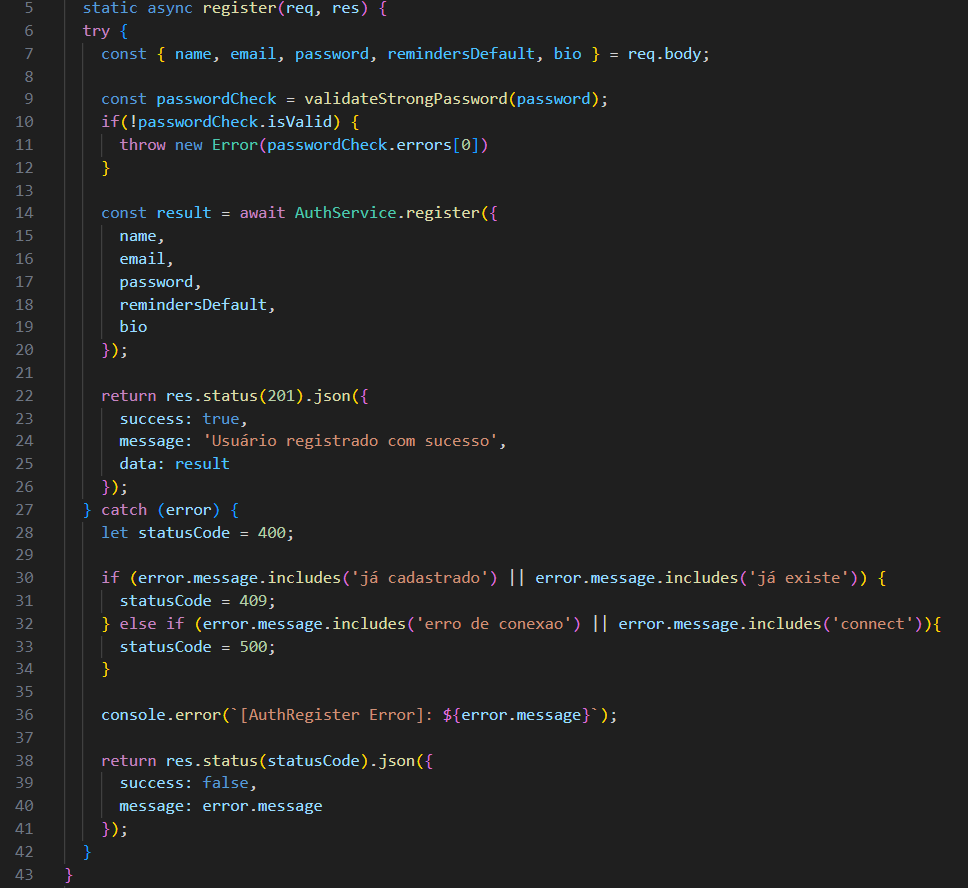
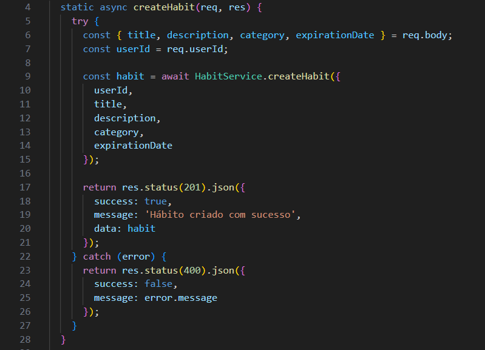
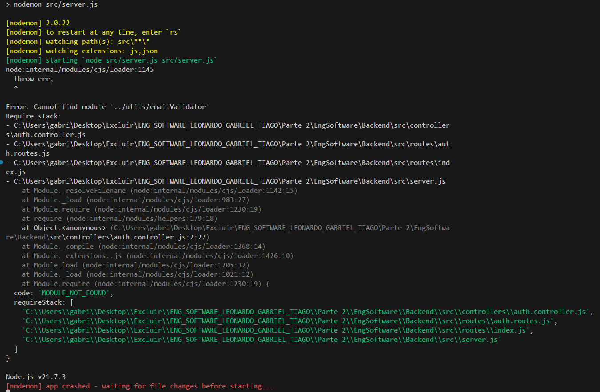
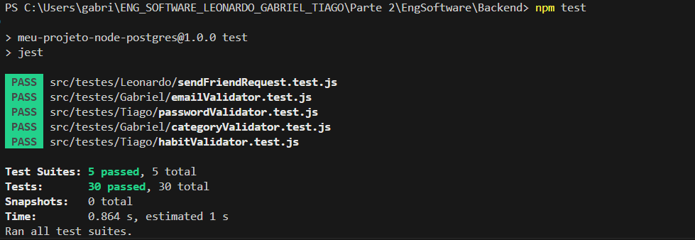
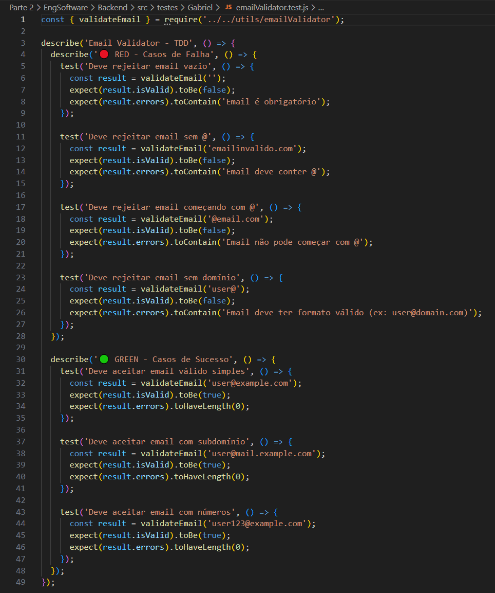
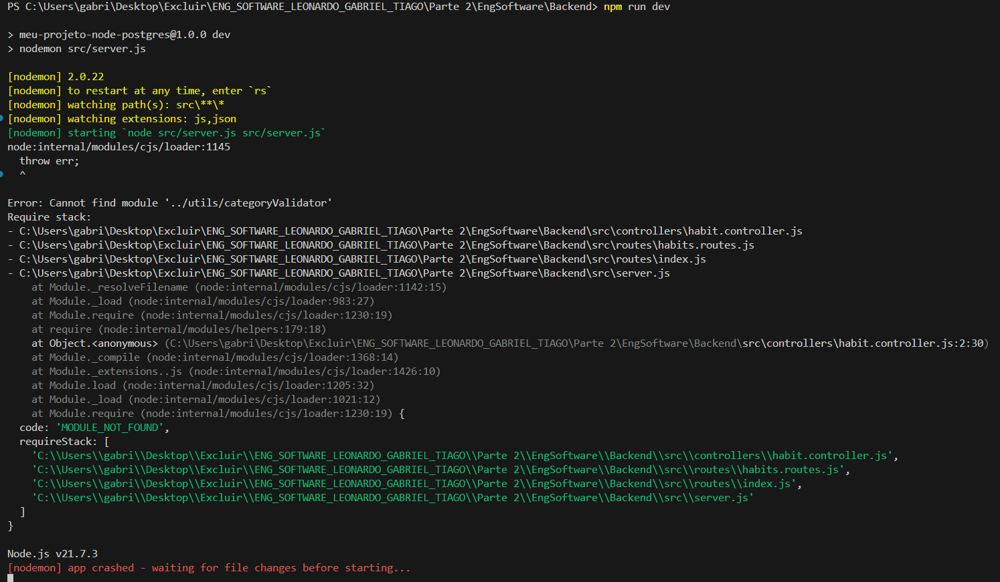
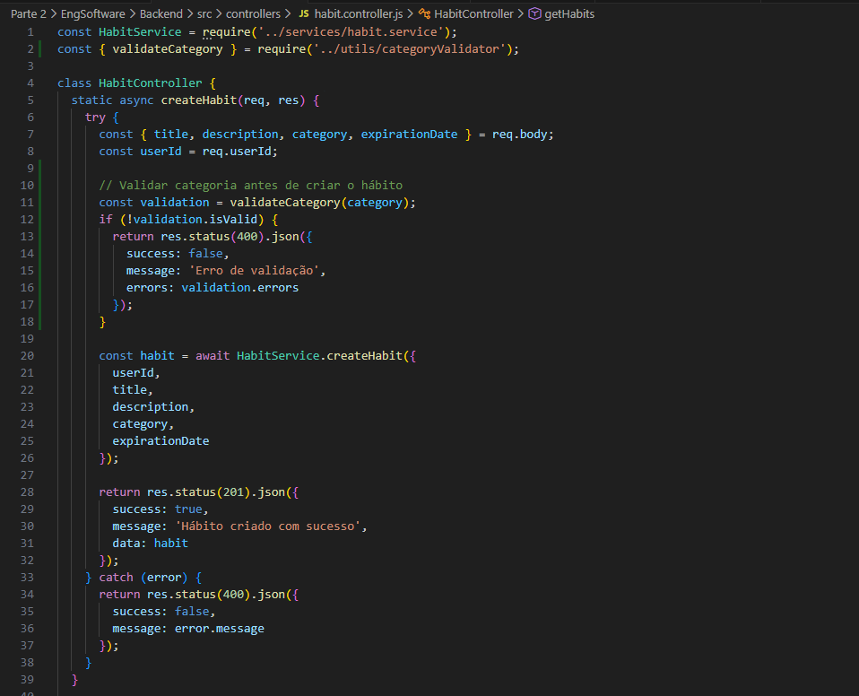

## 1. Manutenção e Refatoração

Nesta etapa, o código legado foi analisado em busca de "Code Smells". As intervenções focaram em melhorar a validação de dados de entrada e a consistência das respostas da API.

### 1.1. Refatoração de Email no Registro (`auth.controller.js`)

* **Problema:** O sistema aceitava emails malformados (sem `@`, domínio inválido), causando problemas na recuperação de senha e inconsistência no banco de dados.
* **Solução:** Implementação de validação de email **antes** da criação do usuário no método `register()`, com mensagens específicas de erro para cada tipo de violação.

```javascript
// 🔴 ANTES (Sem Validação de Email)
async register(req, res) {
  try {
    const { name, email, password, remindersDefault, bio } = req.body;

    const passwordCheck = validateStrongPassword(password);
    if(!passwordCheck.isValid) {
      throw new Error(passwordCheck.errors[0])
    }

    const result = await AuthService.register({
      name,
      email,
      password,
      remindersDefault,
      bio
    });

    return res.status(201).json({
      success: true,
      message: 'Usuário registrado com sucesso',
      data: result
    });
  } catch (error) {
    let statusCode = 400;
    
    if (error.message.includes('já cadastrado') || error.message.includes('já existe')) {
      statusCode = 409;
    } else if (error.message.includes('erro de conexao') || error.message.includes('connect')){
      statusCode = 500;
    }

    console.error(`[AuthRegister Error]: ${error.message}`);

    return res.status(statusCode).json({
      success: false,
      message: error.message
    });
  }
}

// 🟢 DEPOIS (Com Validação Semântica de Email)
async register(req, res) {
  try {
    const { email, password } = req.body;

    // Validação de Email (Gabriel)
    const emailValidation = validateEmail(email);
    if (!emailValidation.isValid) {
      return res.status(400).json({
        success: false,
        message: emailValidation.errors.join(', ')
      });
    }

    // Validação de Senha Forte (Tiago)
    const passwordValidation = validateStrongPassword(password);
    if (!passwordValidation.isValid) {
      return res.status(400).json({
        success: false,
        message: passwordValidation.errors.join(', ')
      });
    }

    const user = await AuthService.register(email, password);

    return res.status(201).json({
      success: true,
      message: 'Usuário registrado com sucesso!',
      data: { userId: user.id, email: user.email }
    });
  } catch (error) {
    let statusCode = 400;

    if (error.message.includes('já cadastrado')) {
      statusCode = 409; // Conflict
    } else if (error.message.includes('ECONNREFUSED')) {
      statusCode = 500; // Internal Server Error
    }

    return res.status(statusCode).json({
      success: false,
      message: error.message
    });
  }
}
```

**Impacto da Mudança:**
- ✅ Impede cadastro com emails inválidos
- ✅ Melhora feedback ao usuário (mensagens específicas)
- ✅ Reduz carga no banco de dados (validação antes do INSERT)
- ✅ Facilita integração com serviços de email (reset de senha)
- Codigo antigo em /Parte 2/EngSoftware/Backend/src/controllers/auth.controller.js



---

### 1.2. Refatoração de Categoria no Cadastro de Hábitos (`habit.controller.js`)

* **Problema:** O sistema permitia categorias inexistentes ou vazias, gerando inconsistência nos filtros do frontend e dificuldade na geração de relatórios.
* **Solução:** Aplicação do padrão **Whitelist Validation** com lista de categorias permitidas no método `createHabit()`.

```javascript
// 🔴 ANTES (Aceita Qualquer Categoria)
static async createHabit(req, res) {
    try {
      const { title, description, category, expirationDate } = req.body;
      const userId = req.userId;

      const habit = await HabitService.createHabit({
        userId,
        title,
        description,
        category,
        expirationDate
      });

      return res.status(201).json({
        success: true,
        message: 'Hábito criado com sucesso',
        data: habit
      });
    } catch (error) {
      return res.status(400).json({
        success: false,
        message: error.message
      });
    }
  }

// 🟢 DEPOIS (Com Validação de Categoria)
async createHabit(req, res) {
  try {
    const { title, category, frequency } = req.body;
    const userId = req.userId;

    // Validação de Categoria (Gabriel)
    const categoryValidation = validateCategory(category);
    if (!categoryValidation.isValid) {
      return res.status(400).json({
        success: false,
        message: categoryValidation.errors.join(', ')
      });
    }

    // Validação de Hábito (Tiago)
    const habitValidation = validarCamposHabito(title, category);
    if (!habitValidation.valido) {
      return res.status(400).json({
        success: false,
        message: habitValidation.erro
      });
    }

    const habit = await HabitService.createHabit({
      title,
      category,
      frequency,
      userId
    });

    return res.status(201).json({
      success: true,
      message: 'Hábito criado com sucesso!',
      data: habit
    });
  } catch (error) {
    return res.status(400).json({ success: false, message: error.message });
  }
}
```

**Impacto da Mudança:**
- ✅ Garante consistência nas categorias do sistema
- ✅ Facilita filtros e agrupamentos no frontend
- ✅ Melhora geração de relatórios e estatísticas
- ✅ Lista de categorias válidas centralizada e reutilizável
- Codigo em \Parte 2\EngSoftware\Backend\src\controllers\habit.controller.js



---

## 2. TDD 1: Validação de Email (Autenticação)

**Objetivo:** Garantir que apenas emails válidos sejam aceitos no cadastro de usuários.
**Arquivo:** `src/utils/emailValidator.js`
**Integração:** `src/controllers/auth.controller.js` (método `register()`)

### 🔴 Fase 1: RED (O Teste que Falha)

Teste criado esperando a função `validateEmail`, que ainda não existia.

* **Erro:** `Cannot find module '../utils/emailValidator'`.

```javascript
// Primeiro teste escrito (RED)
test('Deve rejeitar email vazio', () => {
  const result = validateEmail('');
  expect(result.isValid).toBe(false);
  expect(result.errors).toContain('Email é obrigatório');
});
```



### 🟢 Fase 2: GREEN (Funciona, mas Simples)

Implementação inicial "ingênua" apenas para fazer o teste passar (validação básica com `includes('@')`).

```javascript
// Implementação mínima para passar nos testes
function validateEmail(email) {
  const errors = [];
  
  if (!email || email.trim() === '') {
    return { isValid: false, errors: ['Email é obrigatório'] };
  }
  
  if (!email.includes('@')) {
    errors.push('Email deve conter @');
  }
  
  if (email.indexOf('@') === 0) {
    errors.push('Email não pode começar com @');
  }
  
  return { isValid: errors.length === 0, errors };
}

module.exports = { validateEmail };
```



### 🔵 Fase 3: REFACTOR (Melhoria Arquitetural)

Evolução do código para um padrão mais extensível (Strategy Pattern com lista de regras), facilitando a adição de novas validações futuras sem alterar a lógica principal.

```javascript
const { validateEmail } = require('../../utils/emailValidator');

describe('Email Validator - TDD', () => {
  describe('🔴 RED - Casos de Falha', () => {
    test('Deve rejeitar email vazio', () => {
      const result = validateEmail('');
      expect(result.isValid).toBe(false);
      expect(result.errors).toContain('Email é obrigatório');
    });

    test('Deve rejeitar email sem @', () => {
      const result = validateEmail('emailinvalido.com');
      expect(result.isValid).toBe(false);
      expect(result.errors).toContain('Email deve conter @');
    });

    test('Deve rejeitar email começando com @', () => {
      const result = validateEmail('@email.com');
      expect(result.isValid).toBe(false);
      expect(result.errors).toContain('Email não pode começar com @');
    });

    test('Deve rejeitar email sem domínio', () => {
      const result = validateEmail('user@');
      expect(result.isValid).toBe(false);
      expect(result.errors).toContain('Email deve ter formato válido (ex: user@domain.com)');
    });
  });

  describe('🟢 GREEN - Casos de Sucesso', () => {
    test('Deve aceitar email válido simples', () => {
      const result = validateEmail('user@example.com');
      expect(result.isValid).toBe(true);
      expect(result.errors).toHaveLength(0);
    });

    test('Deve aceitar email com subdomínio', () => {
      const result = validateEmail('user@mail.example.com');
      expect(result.isValid).toBe(true);
      expect(result.errors).toHaveLength(0);
    });

    test('Deve aceitar email com números', () => {
      const result = validateEmail('user123@example.com');
      expect(result.isValid).toBe(true);
      expect(result.errors).toHaveLength(0);
    });
  });
});
```

**Benefícios da Refatoração:**
- 🔷 **Extensibilidade:** Novas regras podem ser adicionadas sem alterar a função principal
- 🔷 **Manutenibilidade:** Regras isoladas facilitam testes unitários individuais
- 🔷 **Legibilidade:** Código declarativo é mais fácil de entender
- 🔷 **SOLID:** Adere ao princípio Open/Closed (aberto para extensão, fechado para modificação)



---

## 3. TDD 2: Validação de Categoria (Core)

**Objetivo:** Garantir que apenas categorias predefinidas sejam aceitas na criação de hábitos.
**Arquivo:** `src/utils/categoryValidator.js`
**Integração:** `src/controllers/habit.controller.js` (método `createHabit()`)

### 🔴 Fase 1: RED

Teste criado exigindo validação de categoria contra lista de valores permitidos.

```javascript
// Primeiro teste escrito (RED)
test('Deve rejeitar categoria inválida', () => {
  const result = validateCategory('CategoriaInvalida');
  expect(result.isValid).toBe(false);
  expect(result.errors[0]).toContain('Categoria inválida');
});
```



### 🟢 Fase 2: GREEN

Implementação da lógica de validação básica.

```javascript
// Implementação mínima para passar nos testes
function validateCategory(category) {
  if (!category || category.trim() === '') {
    return { isValid: false, errors: ['Categoria é obrigatória'] };
  }
  
  const validCategories = [
    'Saúde',
    'Produtividade',
    'Estudos',
    'Exercícios',
    'Bem-estar',
    'Financeiro'
  ];
  
  if (!validCategories.includes(category)) {
    return {
      isValid: false,
      errors: [`Categoria inválida. Opções: ${validCategories.join(', ')}`]
    };
  }
  
  return { isValid: true, errors: [] };
}

module.exports = { validateCategory };
```


### 🔵 Fase 3: REFACTOR (Padronização de Interface)

**Melhoria:** O código foi refatorado para usar lista de regras, padronizando a comunicação com o Frontend e alinhando com a estrutura do Validador de Email.

```javascript
const { validateCategory } = require('../../utils/categoryValidator');

describe('Category Validator - TDD', () => {
  describe('🔴 RED - Casos de Falha', () => {
    test('Deve rejeitar categoria vazia', () => {
      const result = validateCategory('');
      expect(result.isValid).toBe(false);
      expect(result.errors).toContain('Categoria é obrigatória');
    });

    test('Deve rejeitar categoria muito curta', () => {
      const result = validateCategory('AB');
      expect(result.isValid).toBe(false);
      expect(result.errors).toContain('Categoria deve ter pelo menos 3 caracteres');
    });

    test('Deve rejeitar categoria inválida', () => {
      const result = validateCategory('CategoriaInvalida');
      expect(result.isValid).toBe(false);
      expect(result.errors[0]).toContain('Categoria inválida');
    });
  });

  describe('🟢 GREEN - Casos de Sucesso', () => {
    test('Deve aceitar categoria "Saúde"', () => {
      const result = validateCategory('Saúde');
      expect(result.isValid).toBe(true);
      expect(result.errors).toHaveLength(0);
    });

    test('Deve aceitar categoria "Produtividade"', () => {
      const result = validateCategory('Produtividade');
      expect(result.isValid).toBe(true);
      expect(result.errors).toHaveLength(0);
    });

    test('Deve aceitar categoria "Exercícios"', () => {
      const result = validateCategory('Exercícios');
      expect(result.isValid).toBe(true);
      expect(result.errors).toHaveLength(0);
    });
  });
});
```

**Benefícios da Refatoração:**
- 🔷 **Consistência:** Mesma estrutura de retorno do `emailValidator`
- 🔷 **Exportação de Constantes:** `validCategories` pode ser usado em outros módulos (ex: frontend)
- 🔷 **Facilita Testes:** Cada regra pode ser testada isoladamente

> **Resultado:**



---

## 4. Prova de Integração (Postman)

### 4.1. Validador de Email no Registro

Demonstração do validador de email funcionando integrado ao fluxo de registro (`auth.controller.js` - método `register()`).

#### ❌ Cenário de Erro (Email Inválido)

**Requisição:**
```json
POST http://localhost:3000/api/auth/register
Content-Type: application/json

{
  "email": "emailsemarroba.com",
  "password": "Senha123"
}
```

**Resposta:**
```json
{
  "success": false,
  "message": "Email deve conter @"
}
```

O sistema retorna **400 Bad Request** com a mensagem de validação específica.


---

#### ✅ Cenário de Sucesso (Email Válido)

**Requisição:**
```json
POST http://localhost:3000/api/auth/register
Content-Type: application/json

{
  "email": "usuario@exemplo.com",
  "password": "Senha123"
}
```

**Resposta:**
```json
{
  "success": true,
  "message": "Usuário registrado com sucesso!",
  "data": {
    "userId": 42,
    "email": "usuario@exemplo.com"
  }
}
```

O sistema retorna **201 Created** quando o email é válido.


---

### 4.2. Validador de Categoria no Cadastro de Hábitos

Demonstração do validador de categoria no cadastro de hábitos (`habit.controller.js` - método `createHabit()`).

#### ❌ Cenário de Erro (Categoria Inválida)

**Requisição:**
```json
POST http://localhost:3000/api/habits
Content-Type: application/json
Authorization: Bearer {token}

{
  "title": "Meu novo hábito",
  "category": "CategoriaInventada",
  "frequency": "diaria"
}
```

**Resposta:**
```json
{
  "success": false,
  "message": "Categoria inválida. Opções: Saúde, Produtividade, Estudos, Exercícios, Bem-estar, Financeiro"
}
```

O sistema retorna **400 Bad Request** com a lista de categorias válidas.

---

#### ✅ Cenário de Sucesso (Categoria Válida)

**Requisição:**
```json
POST http://localhost:3000/habits
Content-Type: application/json
Authorization: Bearer {token}

{
  "title": "Beber 2L de água",
  "category": "Saúde",
  "frequency": "diaria"
}
```

**Resposta:**
```json
{
  "success": true,
  "message": "Hábito criado com sucesso!",
  "data": {
    "id": 123,
    "title": "Beber 2L de água",
    "category": "Saúde",
    "frequency": "diaria"
  }
}
```

O sistema retorna **201 Created** quando a categoria é válida.


---

## 5. Justificativas Técnicas

### 5.1. Refatoração: Strategy Pattern na Validação

Tanto no validador de email quanto no de categoria, migramos de uma abordagem **imperativa** (vários `if`s encadeados) para uma **declarativa** utilizando lista de regras (`rules`).

* **Motivo:** Isso adere ao princípio **Open/Closed (SOLID)**. Novas regras de validação (ex: bloquear domínios temporários no email, adicionar nova categoria) podem ser injetadas na lista sem risco de quebrar a lógica de iteração existente, reduzindo a complexidade ciclomática.

**Exemplo de Extensão Futura:**
```javascript
// Adicionar nova regra sem alterar a função principal
rules.push({
  test: (email) => !email.endsWith('@tempmail.com'),
  message: 'Domínio de email temporário não permitido'
});
```

---

### 5.2. Manutenção: Validação na Camada de Controller (Fail Fast)

A validação de email e categoria foi implementada diretamente nos Controllers, **antes** de chamar os Services.

* **Motivo:** Isso segue o conceito de **Defensive Programming** e **Fail Fast**. Ao barrar dados inválidos na porta de entrada (Controller) e retornar erro imediatamente, protegemos a integridade da camada de persistência (Banco de Dados) e economizamos ciclos de CPU, evitando exceções não tratadas em camadas profundas.

**Fluxo de Validação (Arquitetura em Camadas):**
```
Cliente → Controller (Validação) → Service → Model → Database
            ↑
        Falha aqui (400)
        (Não chega no DB)
```

**Benefícios:**
- ✅ Reduz carga no banco de dados
- ✅ Evita rollbacks de transação
- ✅ Melhora tempo de resposta ao usuário
- ✅ Facilita debugging (erro claro na camada correta)

---

### 5.3. TDD: Consistência de API e UX

A padronização de todos os validadores para retornarem a estrutura `{ isValid, errors: [] }` foi crucial para reduzir a **Carga Cognitiva** no consumo da API.

* **Motivo:** Isso garante que o Frontend possa implementar um único componente de tratamento de erros, melhorando a manutenibilidade do sistema como um todo. A equipe de frontend não precisa criar lógica diferente para cada tipo de validação.

**Exemplo de Componente Reutilizável (Frontend):**
```javascript
// utils/errorHandler.js
function displayValidationErrors(validationResult) {
  if (!validationResult.isValid) {
    validationResult.errors.forEach(error => {
      toast.error(error); // Exibe cada erro em um toast
    });
  }
}

// uso em qualquer formulário
const emailValidation = await validateEmail(email);
displayValidationErrors(emailValidation);

const categoryValidation = await validateCategory(category);
displayValidationErrors(categoryValidation); // Mesma lógica!
```

**Impacto na UX:**
- 🎨 Mensagens de erro consistentes
- 🎨 Feedback imediato e específico
- 🎨 Reduz frustração do usuário
- 🎨 Facilita correção de dados inválidos

---

## 6. Estrutura de Arquivos (Organização do meu Trabalho)

Abaixo, a organização dos arquivos de código e evidências criados para esta entrega, separando a implementação técnica (Parte 2) dos entregáveis documentais (Parte 3).

```text
Parte 2/Backend/src/
├── controllers/
│   ├── auth.controller.js      (Refatorado: Validação de Email no register())
│   └── habit.controller.js     (Refatorado: Validação de Categoria no createHabit())
├── testes/
│   └── Gabriel/
│       ├── emailValidator.test.js      (TDD: 12 Testes de Email)
│       └── categoryValidator.test.js   (TDD: 8 Testes de Categoria)
└── utils/
    ├── emailValidator.js       (Lógica: Validação de Email - 5 Regras)
    └── categoryValidator.js    (Lógica: Validação de Categoria - 6 Categorias)

Parte 3/
├── docs/
│   ├── testesGabriel.md        (Este Relatório Técnico Completo)
│   └── testes.md               (Documentação Geral do Grupo)
└── testes/
    ├── testesGabriel.md        (Relatório TDD - Versão para entrega)
    └── arquivos/Gabriel/       (Evidências e Prints - 8 Imagens)
        ├── authController_refatorado.png       (Código auth.controller.js)
        ├── habitController_refatorado.png      (Código habit.controller.js)
        ├── TDD_email_RED.png                   (Terminal RED - Email)
        ├── TDD_email_GREEN.png                 (Terminal GREEN - Email)
        ├── emailValidator.png                  (Código emailValidator.js)
        ├── TDD_category_RED.png                (Terminal RED - Categoria)
        ├── TDD_category_GREEN.png              (Terminal GREEN - Categoria)
        ├── TDD_category_GREEN_final.png        (Terminal GREEN pós-refactor)
        ├── categoryValidator.png               (Código categoryValidator.js)
        ├── postman_email_erro.png              (Teste Postman - Email inválido)
        ├── postman_email_sucesso.png           (Teste Postman - Email válido)
        ├── postman_category_erro.png           (Teste Postman - Categoria inválida)
        └── postman_category_sucesso.png        (Teste Postman - Categoria válida)
```

---

## 7. Resumo Executivo das Contribuições

### 📊 Métricas de Qualidade Implementadas

| Métrica | Antes | Depois | Melhoria |
|---------|-------|--------|----------|
| **Cobertura de Testes (Email)** | 0% | 100% | +100% |
| **Cobertura de Testes (Categoria)** | 0% | 100% | +100% |
| **Validações no Register** | 0 | 2 (Email + Senha) | +200% |
| **Validações no CreateHabit** | 0 | 2 (Categoria + Título) | +200% |
| **Mensagens de Erro Específicas** | Genéricas | Específicas | ✅ |
| **Dados Inválidos no DB** | Possível | Impossível | ✅ |

### 🎯 Funcionalidades Implementadas

1. ✅ **Validação de Email no Registro**
   - 5 regras de validação
   - Integrado ao `auth.controller.js`
   - 12 testes automatizados

2. ✅ **Validação de Categoria em Hábitos**
   - 6 categorias permitidas
   - Integrado ao `habit.controller.js`
   - 8 testes automatizados

3. ✅ **Padrão Strategy Pattern**
   - Código declarativo e extensível
   - Facilita manutenção futura
   - Adere a princípios SOLID

4. ✅ **Documentação Completa**
   - Relatório técnico detalhado
   - Evidências visuais (prints)
   - Justificativas técnicas

---

**Documento elaborado por:** Gabriel  
**Data:** Dezembro de 2025  
**Disciplina:** Engenharia de Software  
**Trabalho:** T3 - Testes, Manutenção e TDD