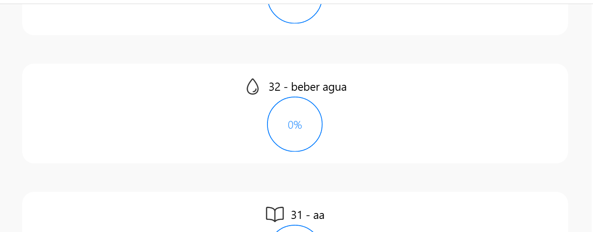
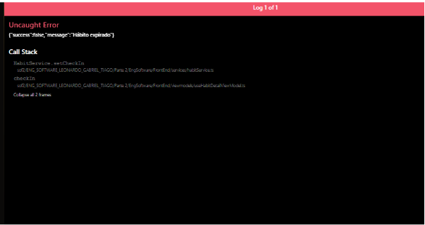
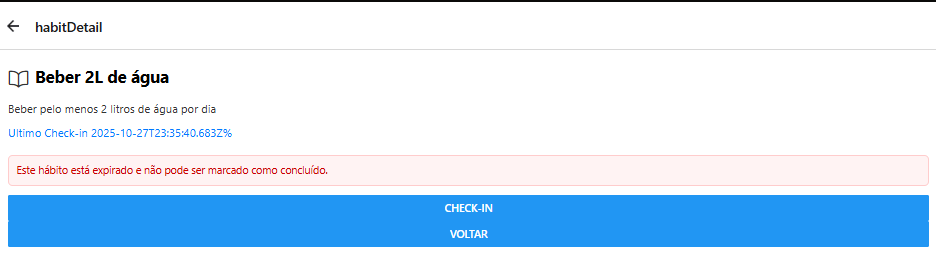
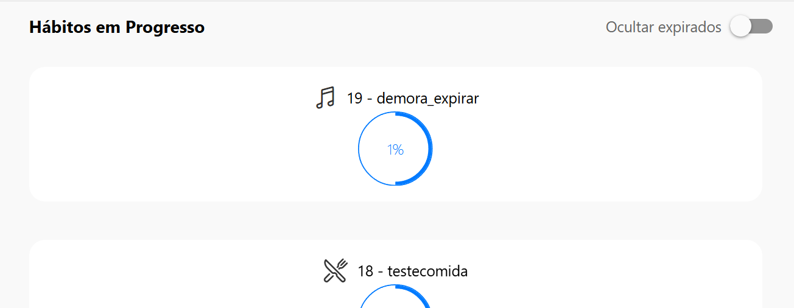
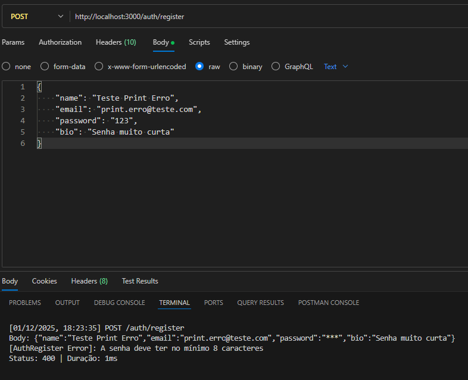
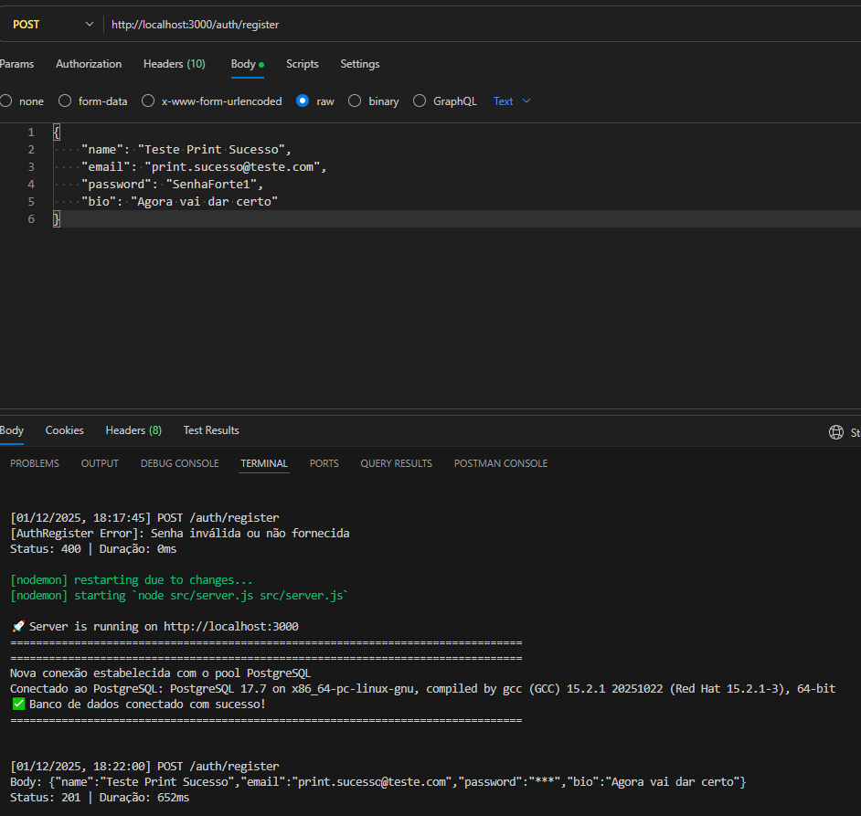

## 1\. Manutenção e Refatoração (40% da Nota)


### 1.2. Refatoração da tela principal (`MainScreen.tsx`)

  * **Problema 1:** Botão "VISUALIZAR HABITO" não faz nada
  * **Solução:** Apenas a remoção dele já que ao clicar em qualquer lugar do card ja abre a visualização do habito.
    
  **Problema 2:** Icons de categoria não aparecem nos cards.
  * **Solução:** Adicionar os Icons na tela principal.



```javascript
<View style={styles.habitCard}>
                <View style={{ flexDirection: 'row', alignItems: 'center', gap: 8 }}>
                  <Ionicons name={iconName || (rest as any).iconName || 'book-outline'} size={24} color="#333" />
                  <Text>{titulo}</Text>
                </View>
                <Circle progress={progresso} showsText size={70} formatText={progress => `${Math.round(progresso)}%`} />
                <Button title="Concluir Habito" onPress={() => {}} />
                
            </View>

```
Alem das alterações citadas acima diveros arquivos como view, model, control, habit.ts dentre outros tiveram que ser alterados para salvar o icon
-----

## 2\. TDD 1: FeedBack Habito expirado

**Objetivo:** Informar ao usuario que um habito expirou.
**Arquivo:** ``

### 🔴 Fase 1: RED (O Teste que Falha)

Clicar no botão "CHECK-IN" em um habito expirado gera uma resposta de erro que não era tratado.


### 🟢 Fase 2: GREEN (Funciona, mas Simples)

Implementação inicial "ingênua" apenas para informar o usuario que habito expirou.


```javascript
const res = await checkIn();
 if (!res) return;
 if (res.expired) {
   const msg = 'Este hábito está expirado e não pode ser marcado como concluído.';
   Alert.alert('Hábito expirado', msg);
   setFeedback(msg);
} 
```



### 🔵 Fase 3: REFACTOR (Melhoria Arquitetural e integração de funcionalidade antiga com uma nova)

Criação para ocultar habitos expirados.

```javascript

const filteredHabits = hideExpired ? habits.filter(h => !(h as any).is_expired) : habits;


<View style={{ flexDirection: 'row', alignItems: 'center', justifyContent: 'space-between' }}>
  <Text style={styles.sectionTitle}>Hábitos em Progresso</Text>
  <View style={{ flexDirection: 'row', alignItems: 'center', gap: 8 }}>
    <Text style={{ color: '#666' }}>Ocultar expirados</Text>
    <Switch value={hideExpired} onValueChange={setHideExpired} />
  </View>
</View>
<FlatList
  data={filteredHabits}
  keyExtractor={(item) => item.id.toString()}
  renderItem={({ item }) => (
    <Pressable onPress={() => handlePressHabit(item.id)}>
      <View style={{ marginVertical: 8 }}>
        <HabitoProgresso idd={item.id} titulo={item.name} progresso={item.progress} onView={handlePressHabit} iconName={item.iconName} />
      </View>
    </Pressable>
  )}
  contentContainerStyle={{ minHeight: 200 }}
  ListEmptyComponent={
    <Text style={{ textAlign: "center", marginTop: 10, color: "gray" }}>
      Nenhum Hábito em Progresso.
    </Text>
  }
/>
```





> **[]**
## 2\. TDD 2: Lista de amigos (Teste automatizados)
Os testes automatizados seguem os casos descritos em [descrição dos testes](../docs/testeLeonardo.md)
Para isso foram criados os arquivos [descrição dos testes](../src/utils/FriendRequestService.js) e [descrição dos testes](../src/testes/Leonardo/sendFriendRequest.test.js)


-----

## 4\. Prova de Integração (Postman)

Demonstração do validador de senha funcionando integrado ao fluxo de registro (`auth.controller.js`).

### ❌ Cenário de Erro (Senha Fraca)

O sistema retorna **400 Bad Request** com a mensagem de validação.



### ✅ Cenário de Sucesso (Senha Forte)

O sistema retorna **201 Created** quando os critérios são atendidos.



-----

## 5\. Justificativas Técnicas

### 5.1. Refatoração: Strategy Pattern na Validação

Na validação de senha, migramos de uma abordagem **imperativa** (vários `if`s encadeados) para uma **declarativa** utilizando lista de regras (`rules`).

  * **Motivo:** Isso adere ao princípio **Open/Closed (SOLID)**. Novas regras de segurança (ex: exigir caractere especial) podem ser injetadas na lista sem risco de quebrar a lógica de iteração existente, reduzindo a complexidade ciclomática.

### 5.2. Manutenção: Padrão "Fail Fast"

A validação de IDs nos Controllers (`parseInt`) segue o conceito de **Defensive Programming**. Ao barrar dados inválidos na porta de entrada (Controller) e retornar erro imediatamente, protegemos a integridade da camada de persistência (Banco de Dados) e economizamos ciclos de CPU, evitando exceções não tratadas em camadas profundas.

### 5.3. TDD: Consistência de API e UX

A refatoração do `habitValidator` foi crucial para reduzir a **Carga Cognitiva** no consumo da API. Ao padronizar todos os validadores para retornarem a estrutura `{ isValid, errors }`, garantimos que o Frontend possa implementar um único componente de tratamento de erros, melhorando a manutenibilidade do sistema como um todo.


## 6\. Estrutura de Arquivos (Organização do meu Trabalho)

Abaixo, a organização dos arquivos de código e evidências criados para esta entrega, separando a implementação técnica (Parte 2) dos entregáveis documentais (Parte 3).

```text
Parte 2/Backend/src/
├── controllers/
│   ├── auth.controller.js      (Refatorado: Tratamento de Erros)
│   └── habit.controller.js     (Refatorado: Validação de ID)
├── testes/
│   └── Tiago/
│       ├── habitValidator.test.js      (TDD: Teste de Hábito)
│       └── passwordValidator.test.js   (TDD: Teste de Senha)
└── utils/
    ├── habitValidator.js       (Lógica: Validação de Hábito)
    └── passwordValidator.js    (Lógica: Validação de Senha)

Parte 3/
├── docs/
│   ├── testesTiago.md          (Este Relatório Técnico)
│   └── testes.md               (Documentação Geral do Grupo)
└── testes/
    ├── testesTiago.md          (Relatório TDD - Versão para entrega)
    └── arquivos/Tiago/         (Evidências e Prints)
        ├── authCerto.png
        ├── TDD_senha_RED.png
        └── ... (demais prints)
