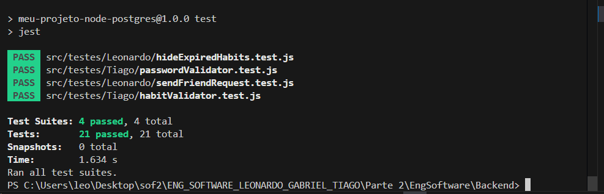
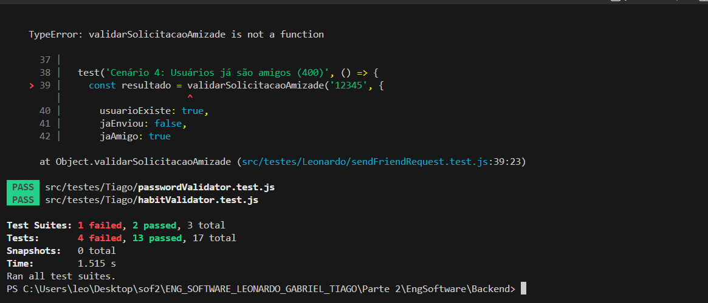
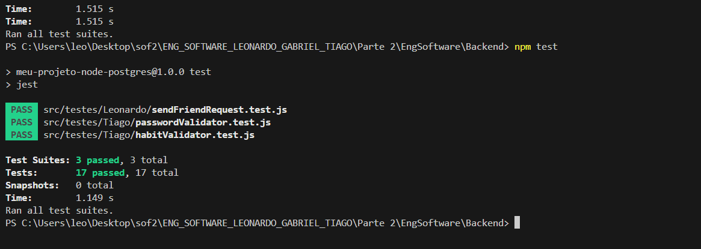
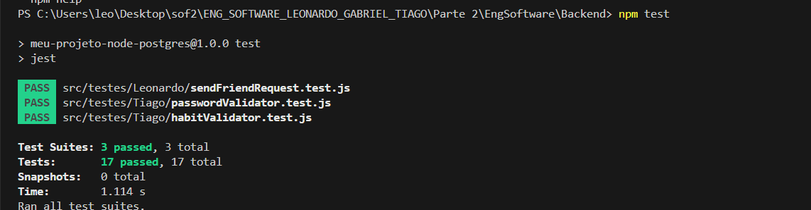

## 1\. Manutenção e Refatoração (40% da Nota)


### 1.2. Refatoração da tela principal (`MainScreen.tsx`)

  * **Problema 1:** Botão "VISUALIZAR HABITO" não faz nada
  * **Solução:** Apenas a remoção dele já que ao clicar em qualquer lugar do card ja abre a visualização do habito.
    
  **Problema 2:** Icons de categoria não aparecem nos cards.
  * **Solução:** Adicionar os Icons na tela principal.


```javascript
<View style={styles.habitCard}>
                <View style={{ flexDirection: 'row', alignItems: 'center', gap: 8 }}>
                  <Ionicons name={iconName || (rest as any).iconName || 'book-outline'} size={24} color="#333" />
                  <Text>{titulo}</Text>
                </View>
                <Circle progress={progresso} showsText size={70} formatText={progress => `${Math.round(progresso)}%`} />
                <Button title="Concluir Habito" onPress={() => {}} />
                
            </View>

```
Alem das alterações citadas acima diveros arquivos como view, model, control, habit.ts dentre outros tiveram que ser alterados para salvar o icon
-----

## 2\. TDD 1: FeedBack Habito expirado (NOVO)

**Objetivo:** Informar ao usuario que um habito expirou.
**Arquivo:** ``

### 🔴 Fase 1: RED (O Teste que Falha)

Clicar no botão "CHECK-IN" em um habito expirado gera uma resposta de erro que não era tratado.


### 🟢 Fase 2: GREEN (Funciona, mas Simples)

Implementação inicial "ingênua" apenas para informar o usuario que habito expirou.


```javascript
const res = await checkIn();
 if (!res) return;
 if (res.expired) {
   const msg = 'Este hábito está expirado e não pode ser marcado como concluído.';
   Alert.alert('Hábito expirado', msg);
   setFeedback(msg);
} 
```


### 🔵 Fase 3: REFACTOR (Melhoria Arquitetural e integração de funcionalidade antiga com uma nova)

Criação para ocultar habitos expirados.

```javascript

const filteredHabits = hideExpired ? habits.filter(h => !(h as any).is_expired) : habits;


<View style={{ flexDirection: 'row', alignItems: 'center', justifyContent: 'space-between' }}>
  <Text style={styles.sectionTitle}>Hábitos em Progresso</Text>
  <View style={{ flexDirection: 'row', alignItems: 'center', gap: 8 }}>
    <Text style={{ color: '#666' }}>Ocultar expirados</Text>
    <Switch value={hideExpired} onValueChange={setHideExpired} />
  </View>
</View>
<FlatList
  data={filteredHabits}
  keyExtractor={(item) => item.id.toString()}
  renderItem={({ item }) => (
    <Pressable onPress={() => handlePressHabit(item.id)}>
      <View style={{ marginVertical: 8 }}>
        <HabitoProgresso idd={item.id} titulo={item.name} progresso={item.progress} onView={handlePressHabit} iconName={item.iconName} />
      </View>
    </Pressable>
  )}
  contentContainerStyle={{ minHeight: 200 }}
  ListEmptyComponent={
    <Text style={{ textAlign: "center", marginTop: 10, color: "gray" }}>
      Nenhum Hábito em Progresso.
    </Text>
  }
/>
```


Alem disso há verificação de erros automaticos na filtragem para verificar se está descartando os que expirou no arquivo /src/testes/Leonardo/hideExpiredHabits.test.js





> **[]**
## 2\. TDD 2: Lista de amigos (Teste automatizados de uma funcinalidade do trabalho 2)


Os testes automatizados seguem os casos descritos em [descrição dos testes](../docs/testeLeonardo.md)
Para isso foram criados os arquivos de src/utils/FriendRequestService.js e de /src/testes/Leonardo/sendFriendRequest.test.js

**Objetivo:** Informar ao usuario que um habito expirou.
**Arquivo:** ``

### 🔴 Fase 1: RED (O Teste que Falha)

Não havia função de validação de dos casos de amizade


### 🟢 Fase 2: GREEN (Funciona, mas Simples)

Implementação inicial "ingênua" apenas para informar o usuario que habito expirou.


```javascript
// Cenário 2: Usuário destino não existe
  if (!estado.usuarioExiste) {
    return { status: 404, mensagem: 'Usuário não encontrado' };
  }

  // Cenário 3: Solicitação já enviada
  if (estado.jaEnviou) {
    return { status: 409, mensagem: 'Solicitação já enviada' };
  }

  // Cenário 4: Usuários já são amigos
  if (estado.jaAmigo) {
    return { status: 400, mensagem: 'Usuários já são amigos' };
  }

  // Cenário 1: Sucesso
  return { status: 200, mensagem: 'Solicitação enviada com sucesso' };
```



### 🔵 Fase 3: REFACTOR (Melhoria Arquitetural e integração de funcionalidade antiga com uma nova)

Criação para ocultar habitos expirados.

```javascript

function validarSolicitacaoAmizade(friendId, regras) {
  // ---- Validações gerais (fail-fast) ----

  // Friend ID precisa ser string não vazia
  if (typeof friendId !== 'string' || friendId.trim() === '') {
    return resposta(400, 'ID do usuário destino inválido');
  }

  // Regras precisam ser um objeto válido
  if (!regras || typeof regras !== 'object') {
    return resposta(500, 'Erro interno: regras não fornecidas corretamente');
  }

  const { usuarioExiste, jaEnviou, jaAmigo } = regras;

  // Verificar se campos obrigatórios estão presentes
  if (usuarioExiste === undefined) {
    return resposta(500, 'Erro interno: campo "usuarioExiste" ausente');
  }
  if (jaEnviou === undefined) {
    return resposta(500, 'Erro interno: campo "jaEnviou" ausente');
  }
  if (jaAmigo === undefined) {
    return resposta(500, 'Erro interno: campo "jaAmigo" ausente');
  }

  // Verificar tipos booleanos
  if (typeof usuarioExiste !== 'boolean') {
    return resposta(500, 'Erro interno: "usuarioExiste" deve ser booleano');
  }
  if (typeof jaEnviou !== 'boolean') {
    return resposta(500, 'Erro interno: "jaEnviou" deve ser booleano');
  }
  if (typeof jaAmigo !== 'boolean') {
    return resposta(500, 'Erro interno: "jaAmigo" deve ser booleano');
  }

  // ---- Regras de negócio (fail-fast) ----

  if (!usuarioExiste) {
    return resposta(404, 'Usuário não encontrado');
  }

  if (jaEnviou) {
    return resposta(409, 'Solicitação já enviada');
  }

  if (jaAmigo) {
    return resposta(400, 'Usuários já são amigos');
  }

  // ---- Tudo OK ----
  return resposta(200, 'Solicitação enviada com sucesso');
}
function resposta(status, mensagem) {
  return { status, mensagem };
}

```




-----

# 5. Justificativas Técnicas

## 5.1. Refatoração da MainScreen: Remoção de lógica redundante e adequação ao fluxo de navegação

A remoção do botão *"Visualizar Hábito"* foi resultado de uma
simplificação arquitetural intencional.\
O card já possuía um *onPress* responsável por navegar para a tela de
detalhes --- portanto, manter um botão adicional criava duplicidade de
função, impacto visual desnecessário e aumento da complexidade de UI sem
benefício real.

Essa refatoração segue princípios de:

-   **Clean UI**
-   **Responsabilidade Única (SRP)**
-   **Minimalismo (Nielsen)**

A adição dos ícones exigiu ajustes no Model, Controller e View.

------------------------------------------------------------------------

## 5.2. Refatoração de Regras de Amizade: Fail Fast + Defensive Programming

A função de validação da solicitação de amizade foi ampliada para
aplicar rigorosamente o padrão **Fail Fast**, validando:

-   ID vazio
-   regras faltando
-   tipos incorretos
-   campos obrigatórios ausentes

Isso protege a API contra estados inválidos e melhora robustez.

------------------------------------------------------------------------

## 5.3. TDD e Consistência de API: Padronização de Estruturas

Tanto no hábito expirado quanto na solicitação de amizade, o TDD
garantiu consistência estrutural:

``` js
{ status, mensagem }
```

Essa padronização reduz complexidade no Frontend e melhora experiência
do desenvolvedor.

------------------------------------------------------------------------

## 5.4. Evolução Arquitetural no TDD 1: Filtragem de Hábitos Expirados

Após o *GREEN*, a funcionalidade foi ampliada com:

-   Switch para ocultar hábitos expirados
-   Separação de lógica de filtragem
-   Melhor UX
-   Aderência ao princípio Open/Closed


