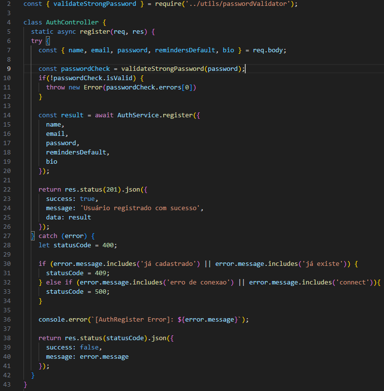
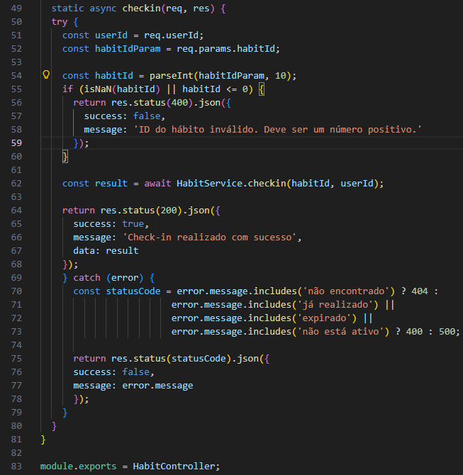
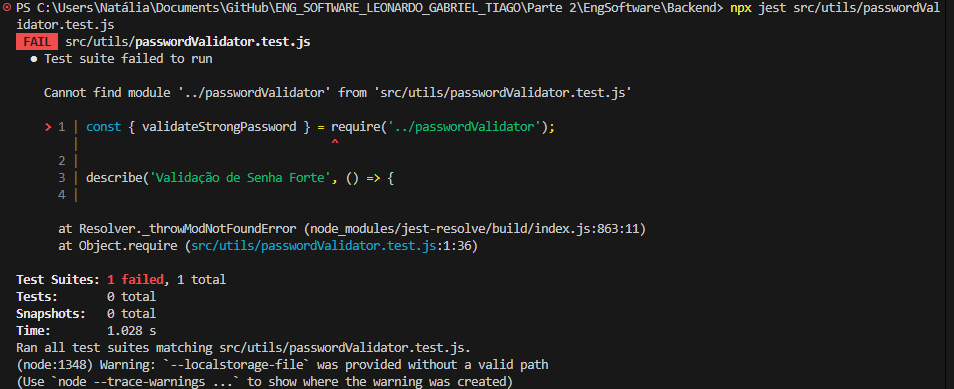
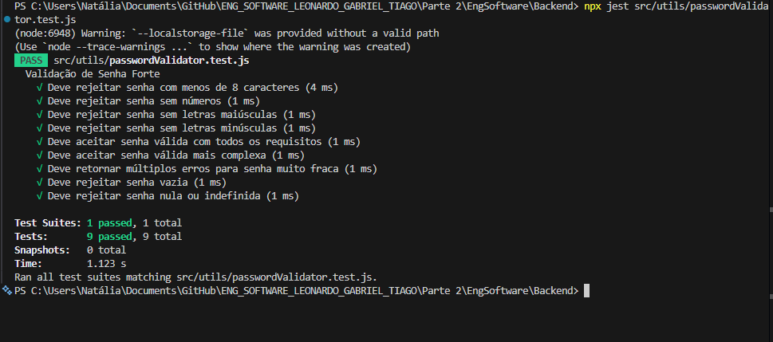
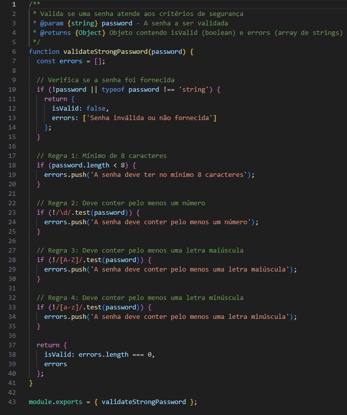
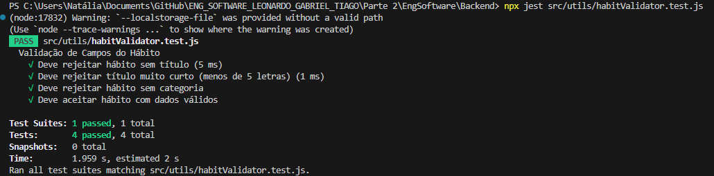

## 1\. Manutenção e Refatoração (40% da Nota)

Nesta etapa, o código legado foi analisado em busca de "Code Smells". As intervenções focaram em melhorar a semântica HTTP e a segurança contra dados inválidos.

### 1.1. Refatoração de Autenticação (`auth.controller.js`)

  * **Problema:** Tratamento de erro genérico (`400`) mascarava falhas críticas.
  * **Solução:** Implementação de tratamento condicional (`409` para conflito, `500` para erro de servidor).

<!-- end list -->

```javascript
// 🟢 DEPOIS (Semântico)
} catch (error) {
  let statusCode = 400; 

  if (error.message.includes('já cadastrado')) {
    statusCode = 409; // Conflict
  } else if (error.message.includes('ECONNREFUSED')) {
    statusCode = 500; // Internal Server Error
  }

  return res.status(statusCode).json({ success: false, message: error.message });
}
```



-----

### 1.2. Refatoração de Hábitos (`habit.controller.js`)

  * **Problema:** O método `checkin` não validava o tipo do ID recebido na URL.
  * **Solução:** Aplicação do padrão **Fail Fast** com validação de tipo.

<!-- end list -->

```javascript
// 🟢 DEPOIS (Com Validação de Segurança)
const { habitId } = req.params;
const parsedId = parseInt(habitId, 10);

if (isNaN(parsedId) || parsedId <= 0) {
  return res.status(400).json({ success: false, message: 'ID inválido.' });
}

const result = await HabitService.checkin(parsedId, userId);
```



-----

## 2\. TDD 1: Validação de Senha Forte (Autenticação)

**Objetivo:** Impedir cadastro com senhas fracas.
**Arquivo:** `src/utils/tiago/passwordValidator.js`

### 🔴 Fase 1: RED (O Teste que Falha)

Teste criado esperando a função `validateStrongPassword`, que ainda não existia.

  * **Erro:** `Cannot find module`.



### 🟢 Fase 2: GREEN (Funciona, mas Simples)

Implementação inicial "ingênua" apenas para fazer o teste passar (uso de múltiplos `if`s).

```javascript
function validateStrongPassword(password) {
  const errors = [];
  // Implementação procedural simples
  if (!password) return { isValid: false, errors: ['Senha vazia'] };
  if (password.length < 8) errors.push('Mínimo de 8 caracteres');
  if (!/\d/.test(password)) errors.push('Deve conter número');
  
  return { isValid: errors.length === 0, errors };
}
```



### 🔵 Fase 3: REFACTOR (Melhoria Arquitetural)

Evolução do código para um padrão mais extensível (Strategy Pattern com lista de regras), facilitando a adição de novas validações futuras sem alterar a lógica principal.

```javascript
// Lista de regras declarativa
const rules = [
  { test: (pwd) => pwd.length >= 8, message: 'Mínimo de 8 caracteres' },
  { test: (pwd) => /\d/.test(pwd), message: 'Deve conter número' }
];

function validateStrongPassword(password) {
  if (!password) return { isValid: false, errors: ['Senha vazia'] };

  // Programação funcional: Filtra regras violadas
  const errors = rules
    .filter(rule => !rule.test(password))
    .map(rule => rule.message);

  return { isValid: errors.length === 0, errors };
}
```



-----

## 3\. TDD 2: Validação de Hábito (Core)

**Objetivo:** Garantir integridade de dados na criação de hábitos.
**Arquivo:** `src/utils/tiago/habitValidator.js`

### 🔴 Fase 1: RED

Teste criado exigindo validação de título (min 5 chars) e categoria.


### 🟢 Fase 2: GREEN

Implementação da lógica de validação.

```javascript
function validarCamposHabito(titulo, categoria) {
  if (!titulo || titulo.length < 5) {
    return { valido: false, erro: 'Título inválido (min 5 chars)' };
  }
  if (!categoria) {
    return { valido: false, erro: 'Categoria obrigatória' };
  }
  return { valido: true, erro: null };
}
```



### 🔵 Fase 3: REFACTOR (Padronização de Interface)
**Melhoria:** O código foi refatorado para retornar `{ isValid, errors: [] }`, padronizando a comunicação com o Frontend e alinhando com a estrutura do Validador de Senha.

```javascript

function validarCamposHabito(titulo, categoria) {
  if (!titulo || titulo.trim() === '') {
    return { valido: false, erro: 'Título é obrigatório' };
  }
  if (titulo.length < 5) {
    return { valido: false, erro: 'Título deve ter pelo menos 5 caracteres' };
  }
  if (!categoria || categoria.trim() === '') {
    return { valido: false, erro: 'Categoria é obrigatória' };
  }
  return { valido: true, erro: null };
}

```

> **[]**


-----

## 4\. Prova de Integração (Postman)

Demonstração do validador de senha funcionando integrado ao fluxo de registro (`auth.controller.js`).

### ❌ Cenário de Erro (Senha Fraca)

O sistema retorna **400 Bad Request** com a mensagem de validação.


### ✅ Cenário de Sucesso (Senha Forte)

O sistema retorna **201 Created** quando os critérios são atendidos.


-----

## 5\. Justificativas Técnicas

### 5.1. Refatoração: Strategy Pattern na Validação

Na validação de senha, migramos de uma abordagem **imperativa** (vários `if`s encadeados) para uma **declarativa** utilizando lista de regras (`rules`).

  * **Motivo:** Isso adere ao princípio **Open/Closed (SOLID)**. Novas regras de segurança (ex: exigir caractere especial) podem ser injetadas na lista sem risco de quebrar a lógica de iteração existente, reduzindo a complexidade ciclomática.

### 5.2. Manutenção: Padrão "Fail Fast"

A validação de IDs nos Controllers (`parseInt`) segue o conceito de **Defensive Programming**. Ao barrar dados inválidos na porta de entrada (Controller) e retornar erro imediatamente, protegemos a integridade da camada de persistência (Banco de Dados) e economizamos ciclos de CPU, evitando exceções não tratadas em camadas profundas.

### 5.3. TDD: Consistência de API e UX

A refatoração do `habitValidator` foi crucial para reduzir a **Carga Cognitiva** no consumo da API. Ao padronizar todos os validadores para retornarem a estrutura `{ isValid, errors }`, garantimos que o Frontend possa implementar um único componente de tratamento de erros, melhorando a manutenibilidade do sistema como um todo.
