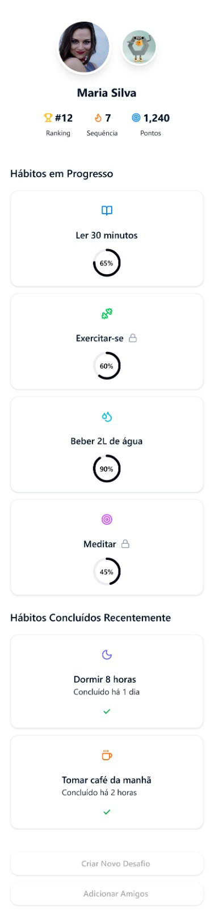
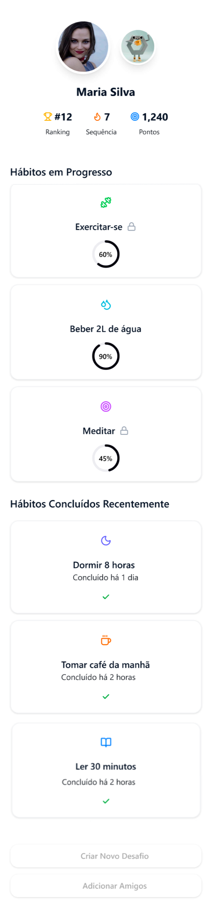

Na tela com os habitos do usuario é possível visualizar um em especifico, nessa tela há informações sobre o habito no dia e em dias anteriores, com um histórico de quão consistente o usuario tem sido naquele habito

Nessa mesma tela é possível encontrar a opção para uso do coringa, que completa o habito no dia, ao clicar em usar a carta o coringa é perdido e o habito é completado

Voltando a tela com os habitos, o habito agora se encontra na seção de habitos concluidos

