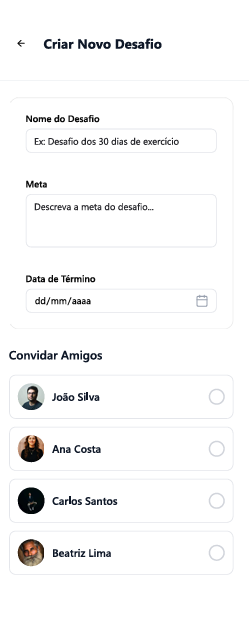
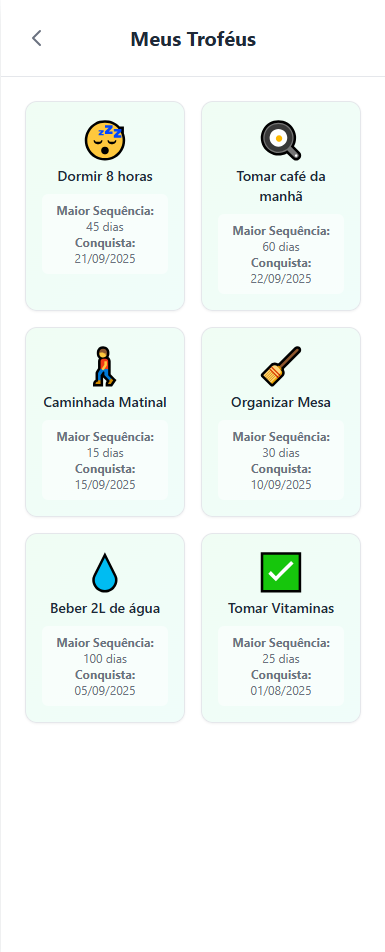
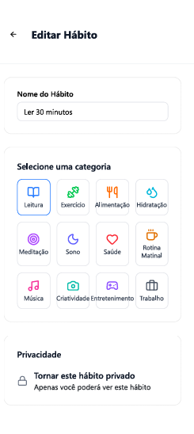
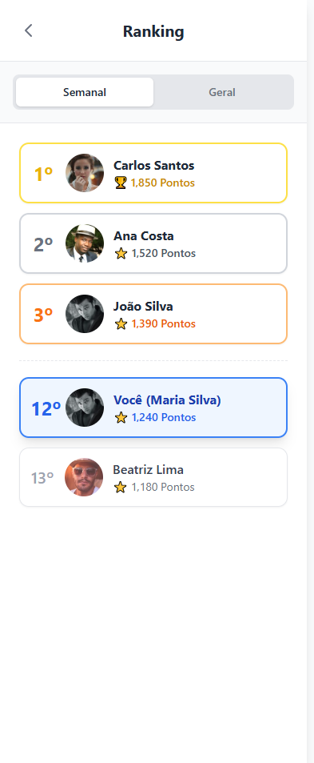

# Fluxo de Telas Tiago

### 1. Tela de Perfil (`1Perfil.png`)

É a tela principal e o hub central do aplicativo. A partir daqui, o usuário pode visualizar seu progresso e navegar para todas as outras seções.

* Para ir à tela de **Ranking (5)**, o usuário clica no ícone de troféu abaixo da sua foto.
* Para ir à tela de **Criar Desafio (2)**, ele clica no botão no final da página.
* Para ir à tela de **Editar Hábito (4)**, ele mantém pressionado em um hábito da lista "Hábitos em Progresso".

### 2. Tela de Criar Novo Desafio (`2crirarDesafio.png`)

Esta tela é acessada a partir do botão `Criar Novo Desafio` na tela de perfil. Aqui, o usuário define uma meta, um prazo e convida amigos para participarem de um desafio em grupo.

### 3. Tela Meus Troféus (`3meusTrofeus.png`)

Esta seção funciona como uma galeria de conquistas. O usuário pode visualizar seu histórico de sucessos, suas maiores sequências e as datas em que atingiu seus objetivos.

### 4. Tela de Editar Hábito (`4editarHabito.png`)

Acessada ao clicar e segurar em um hábito existente na tela de perfil, esta interface permite ao usuário alterar o nome, a categoria e a privacidade de um hábito.

### 5. Tela de Ranking (`5ranking.png`)

Esta tela exibe a classificação geral e semanal dos usuários com base na pontuação. É acessada quando o usuário clica na sua própria estatística de ranking na tela de perfil.

