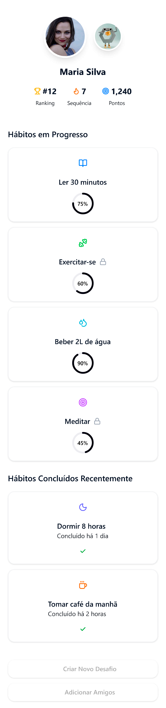
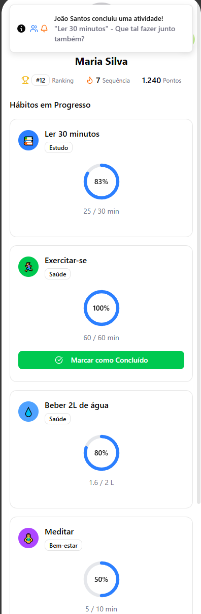
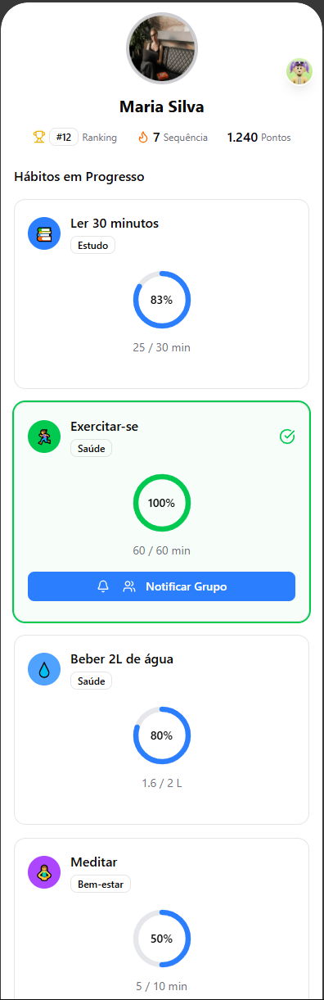
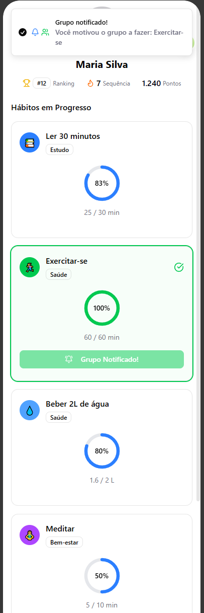

# Fluxo de Telas Gabriel

### 1. Tela de Perfil (`1_Perfil.png`)
Tela de perfil e hub do app. Exibe foto, nome, estatísticas gerais e acesso aos hábitos.

### 2. Tela de Hábitos e Progresso (`2_Habitos_Progresso.png`)
Lista os hábitos do dia com indicadores de progresso e histórico recente de consistência.

- Para marcar um hábito como concluído, tocar no botão de concluir/checkbox embaixo do hábito.

### 3. Hábito Marcado como Concluído (`3_Marcado_concluido.png`)
Após concluir, o hábito é marcado como concluído e as métricas são atualizadas (streak, porcentagem semanal, etc.).

### 4. Notificação de Conclusão (`4_Notificacao_Enviada.png`)
Após o usuário clicar no botão de notificar o grupo, o botão muda de cor e não deixa mais o usuario enviar a mesma notificação.

